<a name="top-anchor"/>

| [Contents](../README.md#table-of-contents) | [Overview](../README.md#scxml-overview) | [Examples](../Examples/README.md) | [Editor](https://alexzhornyak.github.io/ScxmlEditor-Tutorial/) | [Forum](https://github.com/alexzhornyak/SCXML-tutorial/discussions) |
|---|---|---|---|---|

# [Basic HTTP Event I/O Processor](https://www.w3.org/TR/scxml/#BasicHTTPEventProcessor)
[**Video version**](https://youtu.be/bHxh5bKmIzM)

The Basic HTTP Event I/O Processor is intended as a minimal interoperable mechanism for sending and receiving events to and from external components and SCXML 1.0 implementations. **Support for the Basic HTTP Event I/O Processor is optional.**

## Receiving Events
An SCXML Processor that supports the Basic HTTP Event I/O Processor must accept messages at the access URI as **HTTP POST requests** (see [RFC 2616](https://www.w3.org/TR/scxml/#HTTP)).

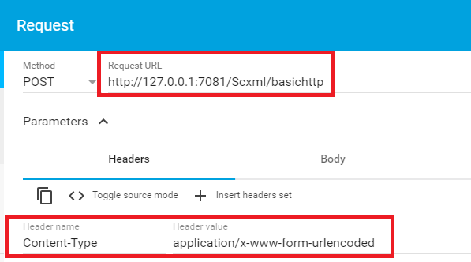

### How to locate HTTP Post Request URL
SCXML Processors that support the BasicHTTP Event I/O Processor must maintain an 'http://www.w3.org/TR/scxml/#BasicHTTPEventProcessor' entry in the **_ioprocessors** system variable. The Processor must maintain a **'location'** field inside this entry whose value holds an address that external entities can use to communicate with this SCXML session using the Basic HTTP Event I/O Processor.

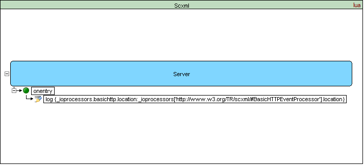

```xml
<scxml datamodel="lua" name="Scxml" version="1.0" xmlns="http://www.w3.org/2005/07/scxml">
	<state id="Server">
		<onentry>
			<log expr="_ioprocessors['http://www.w3.org/TR/scxml/#BasicHTTPEventProcessor'].location" label="_ioprocessors.basichttp.location"/>
		</onentry>
	</state>
</scxml>
```

**Output:**
> [Log] _ioprocessors.basichttp.location: "http://127.0.01:7081/Scxml/basichttp"
>

### How to define the name of the SCXML event in request
If a single instance of the parameter **'_scxmleventname'** is present, the SCXML Processor must use its value as **the name of the SCXML event** that it raises.

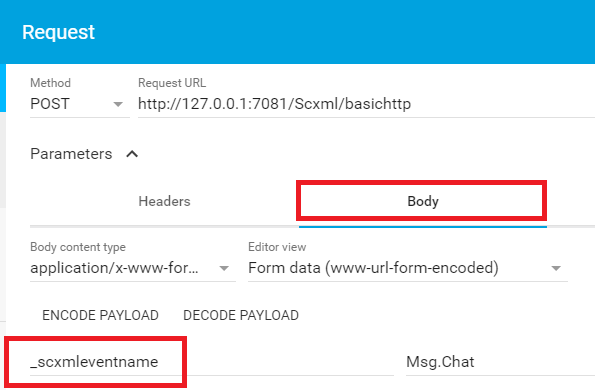

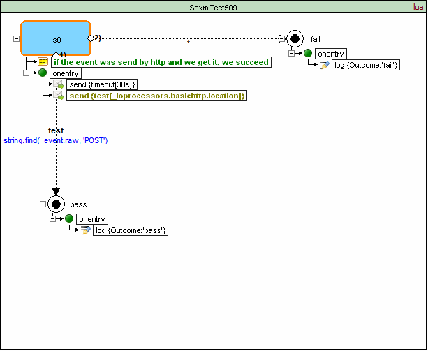

### How to pass data via HTTP Request
The processor must use **any message content** other than **'_scxmleventname'** to populate **_event.data**

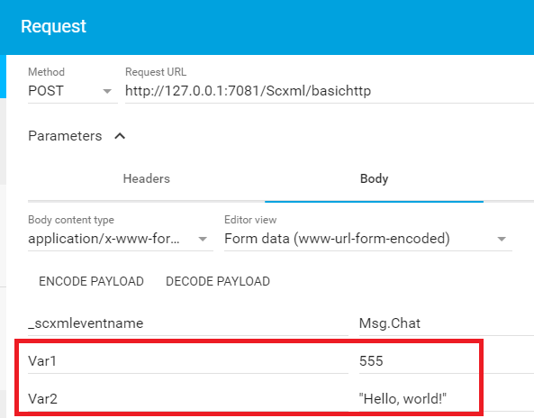

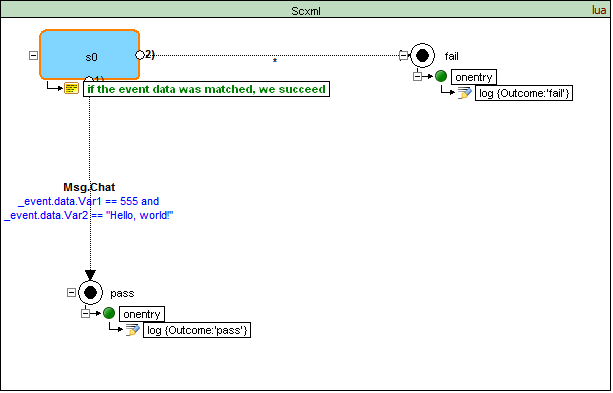

### How to handle request if '\_scxmleventname' is not present
If the parameter **'\_scxmleventname' is not present**, the SCXML Processor must use the name of the HTTP method that was used to deliver the message as the name of the event that it raises.

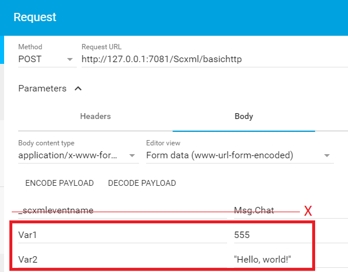

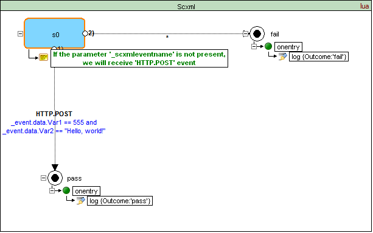

### Indication of the HTTP Request result
The SCXML Processor adds the received message to the appropriate event queue and must then indicate the result to the external component via **a success response code 2XX**. Note that this response is sent before the event is removed from the queue and processed. In the cases where the message cannot be formed into an SCXML event, the Processor must return **an HTTP error code** as defined in [RFC 2616](https://www.w3.org/TR/scxml/#HTTP).

**Example 1: Successfull request**

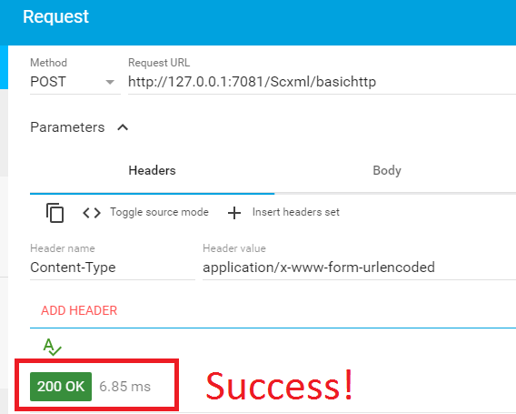


**Example 2: Wrong location**

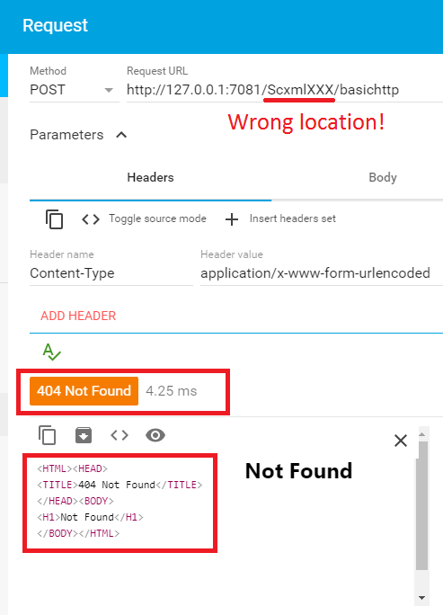


## Sending Events
An SCXML implementation can send events with the Basic HTTP Event I/O Processor using the [**\<send\> element**](send.md) (see [6.2 \<send\>](https://www.w3.org/TR/scxml/#send)) with the type attribute set to **"http://www.w3.org/TR/scxml/#BasicHTTPEventProcessor"** and the target attribute set to **the access URI of the target**. 

The SCXML Processor must attempt to deliver the message using **HTTP method "POST"** and with parameter values encoded by default in an **application/x-www-form-urlencoded** body (POST method). An SCXML Processor may support other encodings, and allow them to be specified in a platform-specific way.

If the **'event'** parameter of [**\<send\>**](send.md) is defined, the SCXML Processor must use its value as the value of the HTTP POST parameter **\_scxmleventname**.

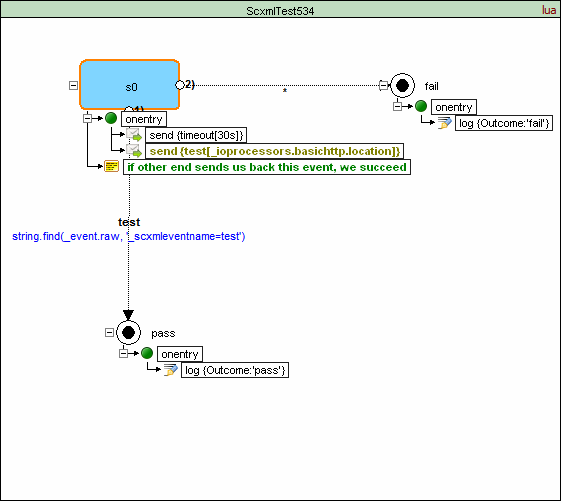

If neither the **'target'** nor the **'targetexpr'** attribute is specified, the SCXML Processor must add the event **error.communication** to the internal event queue of the sending session.

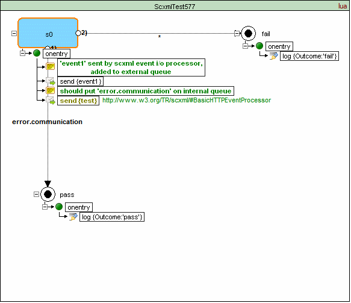

### Namelist
If the **namelist** attribute is defined, the SCXML Processor must map its variable names and values to HTTP POST parameters.

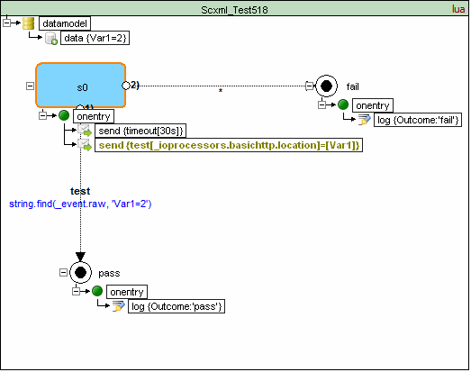

```xml
<scxml datamodel="lua" initial="s0" name="ScxmlTest518" version="1.0" xmlns="http://www.w3.org/2005/07/scxml" xmlns:conf="http://www.w3.org/2005/scxml-conformance">
	<datamodel>
		<data expr="2" id="Var1"/>
	</datamodel>
	<state id="s0">
		<onentry>
			<send delay="30s" event="timeout"/>
			<send event="test" namelist="Var1" targetexpr="_ioprocessors.basichttp.location" type="http://www.w3.org/TR/scxml/#BasicHTTPEventProcessor"/>
		</onentry>
		<transition cond="string.find(_event.raw, 'Var1=2')" event="test" target="pass"/>
		<transition event="*" target="fail"/>
	</state>
	<final id="pass">
		<onentry>
			<log expr="'pass'" label="Outcome"/>
		</onentry>
	</final>
	<final id="fail">
		<onentry>
			<log expr="'fail'" label="Outcome"/>
		</onentry>
	</final>
</scxml>
```

### Params
If one or more [**\<param\>**](param.md) children are present, the SCXML Processor must map their names (i.e. name attributes) and values to HTTP POST parameters.

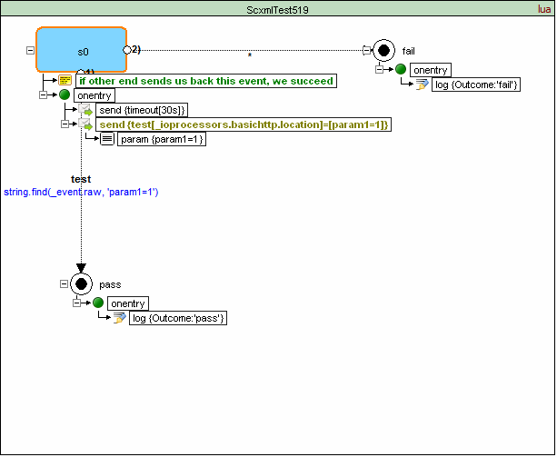

```xml
<scxml datamodel="lua" initial="s0" name="ScxmlTest519" version="1.0" xmlns="http://www.w3.org/2005/07/scxml" xmlns:conf="http://www.w3.org/2005/scxml-conformance">
	<state id="s0">
		<onentry>
			<send delay="30s" event="timeout"/>
			<send event="test" targetexpr="_ioprocessors.basichttp.location" type="http://www.w3.org/TR/scxml/#BasicHTTPEventProcessor">
				<param expr="1" name="param1"/>
			</send>
		</onentry>
		<transition cond="string.find(_event.raw, 'param1=1')" event="test" target="pass"/>
		<transition event="*" target="fail"/>
	</state>
	<final id="pass">
		<onentry>
			<log expr="'pass'" label="Outcome"/>
		</onentry>
	</final>
	<final id="fail">
		<onentry>
			<log expr="'fail'" label="Outcome"/>
		</onentry>
	</final>
</scxml>
```

### Content
If a [**\<content\>**](content.md) child is present, the SCXML Processor must use its value as **the body of the message**.

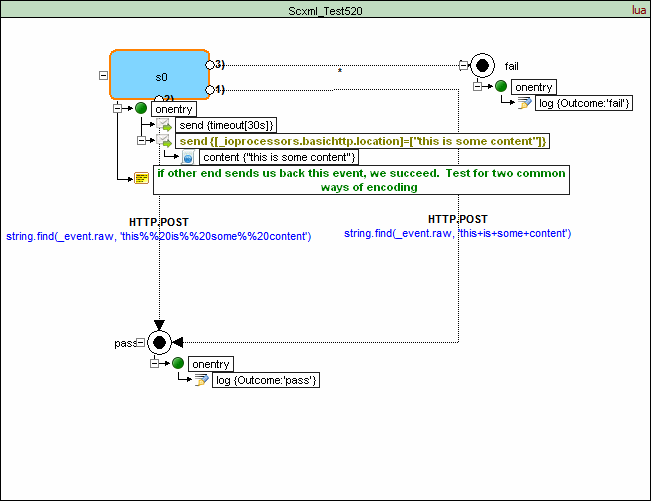

```xml
<scxml datamodel="lua" initial="s0" name="ScxmlTest520" version="1.0" xmlns="http://www.w3.org/2005/07/scxml" xmlns:conf="http://www.w3.org/2005/scxml-conformance">
	<state id="s0">
		<onentry>
			<send delay="30s" event="timeout"/>
			<send targetexpr="_ioprocessors.basichttp.location" type="http://www.w3.org/TR/scxml/#BasicHTTPEventProcessor">
				<content>&quot;this is some content&quot;</content>
			</send>
		</onentry>
		<transition cond="string.find(_event.raw, 'this+is+some+content')" event="HTTP.POST" target="pass"/>
		<transition cond="string.find(_event.raw, 'this%%20is%%20some%%20content')" event="HTTP.POST" target="pass"/>
		<transition event="*" target="fail"/>
	</state>
	<final id="pass">
		<onentry>
			<log expr="'pass'" label="Outcome"/>
		</onentry>
	</final>
	<final id="fail">
		<onentry>
			<log expr="'fail'" label="Outcome"/>
		</onentry>
	</final>
</scxml>
```

| [TOP](#top-anchor) | [Contents](../README.md#table-of-contents) | [Overview](../README.md#scxml-overview) | [Examples](../Examples/README.md) | [Editor](https://alexzhornyak.github.io/ScxmlEditor-Tutorial/) | [Forum](https://github.com/alexzhornyak/SCXML-tutorial/discussions) |
|---|---|---|---|---|---|
