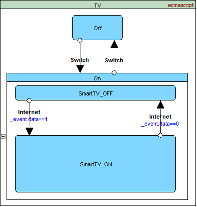
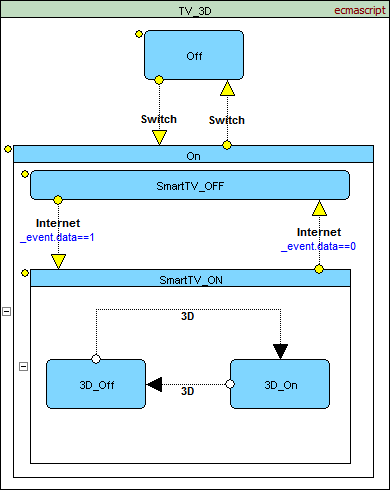
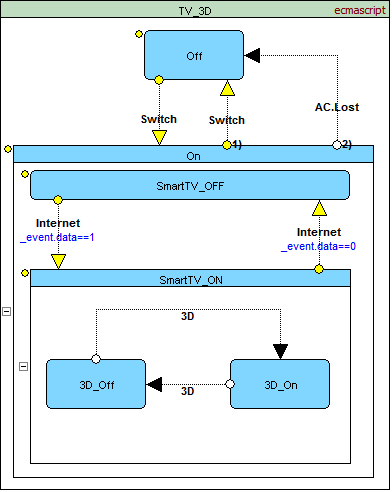
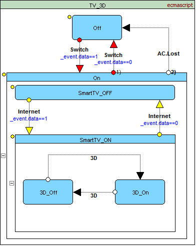

<a name="top-anchor"/>

| [Contents](../README.md#table-of-contents) | [SCXML Wiki](../README.md#scxml-overview) | [Examples](../Examples/README.md) | [Editor](https://alexzhornyak.github.io/ScxmlEditor-Tutorial/) | [Forum](https://github.com/alexzhornyak/SCXML-tutorial/discussions) |
|---|---|---|---|---|

# SCXML (State Machine) Visual Inheritance

Inheritance is a great option of the modern programming. No need to duplicate a source code in derived objects. But what about SCXML State Machines? How could we define a base chart and inherit from it?

Consider a TV without 3D function and 3D TV. A lot of functionality between the two TV types is shared. It's not a big problem to support 2 charts with the same shared code. But what about 10 types of TV. Every time when you make corrections to the base chart you should do the same to the others.

So, how implement inheritance if the official specification do not afford to do this.

### [Visual Inheritance is the solution.](https://github.com/alexzhornyak/ScxmlEditor-Tutorial/blob/master/Doc/Inheritance.md)
## Basic concepts of Visual Inheritance
So, let's describe main concepts that SCXML programmer achieves from visual system

### 1. Base chart
The common functionality could be implemented in a base chart. It must be a regular visual chart.

### 2. Deriving states, transitions and executable content
Derived objects must be marked with a specific color or signs that will inform a programmer about inheritance.
(Yellow circles in the example)

### 3. Additional states, transitions and executable content
They are suggested to be without any signs. They will be easily differed from marked derived ones.

### 4. Overriding states, transitions and executable content
Overrided objects must be marked in separate way then derived objects without changes. (Red color in the example)

| [TOP](#top-anchor) | [Contents](../README.md#table-of-contents) | [Overview](../README.md#scxml-overview) | [Examples](../Examples/README.md) | [Editor](https://alexzhornyak.github.io/ScxmlEditor-Tutorial/) | [Forum](https://github.com/alexzhornyak/SCXML-tutorial/discussions) |
|---|---|---|---|---|---|
