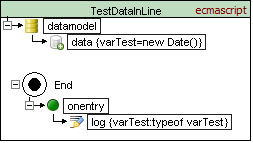
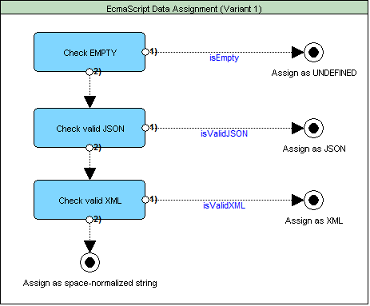
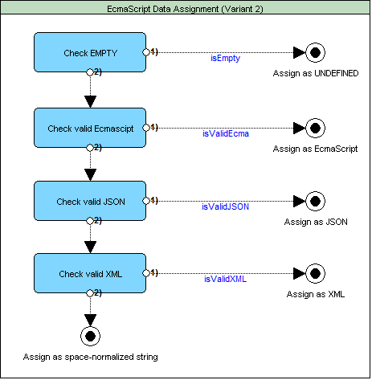

<a name="top-anchor">

| [Contents](../README.md#table-of-contents) | [Overview](../README.md#scxml-overview) | [Examples](../Examples/README.md) | [Editor](https://alexzhornyak.github.io/ScxmlEditor-Tutorial/) | [Forum](https://github.com/alexzhornyak/SCXML-tutorial/discussions) |
|---|---|---|---|---|

## [\<datamodel\>](https://www.w3.org/TR/scxml/#datamodel)

**[Video version](https://youtu.be/M_hmklnfgXg)**

Wrapper element which encapsulates any number of **\<data\>** elements, each of which defines a single data object. The exact nature of the data object depends on the data model language used.

## [\<data\>](https://www.w3.org/TR/scxml/#data)
The element is used to declare and populate portions of the data model.

### Here is an example:
#### 1. Lua
```xml
<datamodel>
    <data expr="true" id="VarBool"/>
    <data expr="1" id="VarInt"/>
    <data expr="'This is a string!'" id="VarString"/>
    <data expr="{ 1, 2, 3, 4, 5 }" id="VarTable"/>
</datamodel>
```
#### 2. EcmaScript
```xml
<data id="VarBool" expr="true"/>
<data id="VarInt" expr="555"/>
<data id="VarFloat" expr="777.777"/>
<data id="VarString" expr="'this is a string'"/>
<data id="VarFunction" expr="function() { return 'hello from func' }"/>
<data id="VarNull" expr="null"/>
<data id="VarUndefined" expr="undefined"/>
<data id="VarComplexObject" expr="new Date()"/>
```

## Attribute Details
<table>
<thead>
<tr>
<th>Name</th><th>Required</th><th>Type</th><th>Default Value</th><th>Valid Values</th><th>Description</th>
</tr>
</thead>
<tbody>
<tr>
<td>id</td><td>true</td><td>ID</td><td>none</td><td></td><td>The name of the data item. See <a href="https://www.w3.org/TR/scxml/#IDs">3.14 IDs</a> for details.</td>
</tr>
<tr>
<td>src</td><td>false</td><td>URI</td><td>none</td><td></td><td>Gives the location from which the data object should be fetched. See <a href="https://www.w3.org/TR/scxml/#ValueExpressions">5.9.3 Legal Data Values and Value Expressions</a> for details.</td>
</tr>
<tr>
<td>expr</td><td>false</td><td>Expression</td><td>none</td><td>Any valid value expression</td><td>Evaluates to provide the value of the data item. See <a href="https://www.w3.org/TR/scxml/#ValueExpressions">5.9.3 Legal Data Values and Value Expressions</a> for details.</td>
</tr>
</tbody>
</table>

## Children
The children of the **\<data\>** element represent an in-line specification of the value of the data object.
In a conformant SCXML document, a **\<data\>** element may have either a **'src'** or an **'expr'** attribute, but must not have both. Furthermore, if either attribute is present, the element must not have any children. Thus **'src'**, **'expr'** and children are mutually exclusive in the **\<data\>** element.

### WARNING! Some platforms ([Qt](https://doc.qt.io/qt-5/qtscxml-index.html), [USCXML](https://github.com/tklab-tud/uscxml)) can modify multiline expressions as space-normalized strings
It means that if you are using a valid multiline expression that successfully runs in one platform like [SCION](https://gitlab.com/scion-scxml)
```xml
<datamodel>
	<data expr="function() {
    var s = 'isFunction'
    return s
}" id="funcExpr"/>
</datamodel>
```
It can be automatically converted to a syntax-invalid single space-normalized string and fail on other platforms like [Qt](https://doc.qt.io/qt-5/qtscxml-index.html) or [USCXML](https://github.com/tklab-tud/uscxml). The reason is of different XML-parsers behaviour
```xml
<!-- multiline expression comes to state machine as single line -->
<data expr="function() { var s = 'isFunction' return s }" id="funcExpr"/> 
```
> 1:SyntaxError: Unexpected keyword 'return'. Expected ';' after var declaration.

## Examples:
### 1. Different data types assigned by 'expr' attribute.


```xml
<scxml datamodel="lua" name="Scxml" version="1.0" xmlns="http://www.w3.org/2005/07/scxml">
	<datamodel>
		<data expr="true" id="VarBool"/>
		<data expr="1" id="VarInt"/>
		<data expr="'This is a string!'" id="VarString"/>
		<data expr="{ 1, 2, 3, 4, 5 }" id="VarTable"/>
	</datamodel>
	<state id="Shape1">
		<onentry>
			<log expr="string.format('Value=[%s] Type=[%s]',tostring(VarBool),type(VarBool))" label="VarBool"/>
			<log expr="string.format('Value=[%s] Type=[%s]',tostring(VarInt),type(VarInt))" label="VarInt"/>
			<log expr="string.format('Value=[%s] Type=[%s]',VarString,type(VarString))" label="VarString"/>
			<log expr="string.format('Value=[%s] Type=[%s]',tostring(VarTable),type(VarTable))" label="VarTable"/>
		</onentry>
		<transition target="End"/>
	</state>
	<final id="End"/>
</scxml>
```

**Output:**
> \[Log\] VarBool: "Value=\[true\] Type=\[boolean\]"
> 
> \[Log\] VarInt: "Value=\[1\] Type=\[number\]"
> 
> \[Log\] VarString: "Value=\[This is a string!\] Type=\[string\]"
> 
> \[Log\] VarTable: "Value=\[table: 003E7790\] Type=\[table\]"

### 2. Data initialized by 'src' attribute.

#### table1.lua
```
{ 
	1, 
	2, 
	3, 
	true, 
	"This a string!" 
}
```
#### datamodel - data src.scxml
```xml
<scxml datamodel="lua" name="Scxml" version="1.0" xmlns="http://www.w3.org/2005/07/scxml">
	<datamodel>
		<data id="VarTable" src="table1.lua"/>
	</datamodel>
	<state id="Shape1">
		<onentry>
			<log expr="string.format('Value=[%s] Type=[%s]',tostring(VarTable),type(VarTable))" label="VarTable"/>
			<foreach array="VarTable" index="indexTable" item="itemTable">
				<log expr="indexTable" label="indexTable"/>
				<log expr="itemTable" label="itemTable"/>
			</foreach>
		</onentry>
		<transition target="End"/>
	</state>
	<final id="End"/>
</scxml>
```

**Output:**
>\[Log\] VarTable: "Value=\[table: 0096B388\] Type=\[table\]" <br>
>\[Log\] indexTable: 1 <br>
>\[Log\] itemTable: 1 <br>
>\[Log\] indexTable: 2 <br>
>\[Log\] itemTable: 2 <br>
>\[Log\] indexTable: 3 <br>
>\[Log\] itemTable: 3 <br>
>\[Log\] indexTable: 4 <br>
>\[Log\] itemTable: true <br>
>\[Log\] indexTable: 5 <br>
>\[Log\] itemTable: "This a string!"

### 3. Data initialized by child value.


```xml
<scxml datamodel="lua" name="Scxml" version="1.0" xmlns="http://www.w3.org/2005/07/scxml">
	<datamodel>
		<data id="VarTable">{ 1, true, &quot;This is a string!&quot; }</data>
	</datamodel>
	<state id="Shape1">
		<onentry>
			<log expr="string.format(&quot;Value=[%s] Type=[%s]&quot;,tostring(VarTable),type(VarTable))" label="VarTable"/>
			<foreach array="VarTable" index="indexTable" item="itemTable">
				<log expr="itemTable" label="itemTable"/>
			</foreach>
		</onentry>
		<transition target="End"/>
	</state>
	<final id="End"/>
</scxml>
```

**Output:**
>\[Log\] VarTable: "Value=\[table: 0083F5E8\] Type=\[table\]"
>
>\[Log\] itemTable: 1
>
>\[Log\] itemTable: true
>
>\[Log\] itemTable: "This is a string!"

## The ECMAScript Data Model
For each \<data\> element in the document, the SCXML Processor must create an ECMAScript variable object whose name is the value of the 'id' attribute of \<data\>. In cases where the 'src' attribute or in-line content is provided in the \<data\> element, then if an indication of the type of the content is available (e.g., via a Content-Type header), then the Processor should try to interpret the content according to that indication. Otherwise if the content (whether fetched or provided in-line) is JSON (and the Processor supports JSON), the SCXML Processor must create the corresponding ECMAScript object. Otherwise, if the content is a valid XML document, the Processor must create the corresponding DOM structure and assign it as the value of the variable. Otherwise the Processor must treat the content as a space-normalized string literal and assign it as the value of the variable. If no value is assigned, the SCXML Processor must assign the variable the default value ECMAScript undefined. Note that the assignment takes place at the time indicated by the ['binding'](scxml.md#3-attribute-binding) attribute on the [\<scxml\>](scxml.md) element.

### WARNING! Be careful of assigning complex objects or functions via in-line content of data
SCXML Platforms may pass [W3C IRP tests](https://www.w3.org/Voice/2013/scxml-irp) but **they may use different variants of assigning in-line content**. <br/>
Let's take a look at the example


```xml
<scxml datamodel="ecmascript" name="TestDataInLine" version="1.0" xmlns="http://www.w3.org/2005/07/scxml">
	<datamodel>
		<data id="varTest">new Date()</data>
	</datamodel>
	<final id="End">
		<onentry>
			<log expr="typeof varTest" label="varTest"/>
		</onentry>
	</final>
</scxml>
```

#### Variant 1. Order of checks: is Empty -> JSON -> XML -> space-normalised string


For example: platforms [USCXML](https://github.com/tklab-tud/uscxml), [SCION](https://gitlab.com/scion-scxml) are using such algorithm and `varTest` will be assigned as **string**. <br/> Output: `[Log] varTest: "string"`

#### Variant 2. Order of checks: is Empty -> EcmaScript -> JSON -> XML -> space-normalised string


For example: platforms [Qt](https://doc.qt.io/qt-5/qtscxml-index.html), [USCXMLClib](https://github.com/alexzhornyak/UscxmlCLib) are using such algorithm and `varTest` will be assigned as Date **object**. <br/>
Output: `"varTest" : "object"`

> NOTICE! If you want to be sure to have the same behaviour of data on every platform, assign complex data via [\<script\>](script.md) element

## [W3C IRP tests](https://www.w3.org/Voice/2013/scxml-irp)

### [1. Test 276](https://www.w3.org/Voice/2013/scxml-irp/276/test276.txml)
The SCXML Processor MUST allow the environment to provide values for top-level data elements at instantiation time. (Top-level data elements are those that are children of the datamodel element that is a child of scxml). Specifically, the Processor MUST use the values provided at instantiation time instead of those contained in these data elements.


### [2. Test 277](https://www.w3.org/Voice/2013/scxml-irp/277/test277.txml)
If the value specified for a data element (by 'src', children, or the environment) is not a legal data value, the SCXML Processor MUST raise place **error.execution** in the internal event queue and MUST create an empty data element in the data model with the specified id.


### [3. Test 279](https://www.w3.org/Voice/2013/scxml-irp/279/test279.txml)
When 'binding' attribute on the [\<scxml\>](scxml.md) element is assigned the value "early" (the default), the SCXML Processor MUST create all data elements and assign their initial values at document initialization time.


### [4. Test 280](https://www.w3.org/Voice/2013/scxml-irp/280/test280.txml)
When 'binding' attribute on the [\<scxml\>](scxml.md) element is assigned the value "late", the SCXML Processor MUST create the data elements at document initialization time, but MUST assign the specified initial value to a given data element only when the state that contains it is entered for the first time, before any onentry markup.


### [5. Test 550](https://www.w3.org/Voice/2013/scxml-irp/550/test550.txml)
If the 'expr' attribute is present, the Platform MUST evaluate the corresponding expression at the time specified by the 'binding' attribute of [\<scxml\>](scxml.md) and MUST assign the resulting value as the value of the data element.


### [6. Test 551](https://www.w3.org/Voice/2013/scxml-irp/551/test551.txml)
If child content is specified, the Platform MUST assign it as the value of the \<data\> element at the time specified by the 'binding' attribute of [\<scxml\>](scxml.md).


### [7. Test 552](https://www.w3.org/Voice/2013/scxml-irp/552/test552.txml)
If the 'src' attribute is present, the Platform MUST fetch the specified object at the time specified by the 'binding' attribute of [\<scxml\>](scxml.md) and MUST assign it as the value of the data element.


**test552.txt**

`1`

| [TOP](#top-anchor) | [Contents](../README.md#table-of-contents) | [Overview](../README.md#scxml-overview) | [Examples](../Examples/README.md) | [Editor](https://alexzhornyak.github.io/ScxmlEditor-Tutorial/) | [Forum](https://github.com/alexzhornyak/SCXML-tutorial/discussions) |
|---|---|---|---|---|---|
