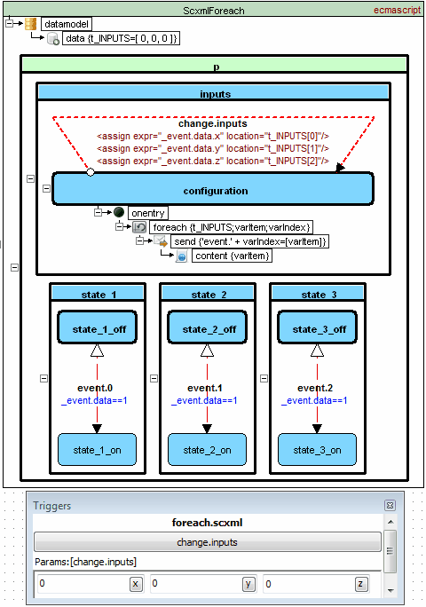

<a name="top-anchor">

| [Contents](../README.md#table-of-contents) | [Overview](../README.md#scxml-overview) | [Examples](../Examples/README.md) | [Editor](https://alexzhornyak.github.io/ScxmlEditor-Tutorial/) | [Forum](https://github.com/alexzhornyak/SCXML-tutorial/discussions) |
|---|---|---|---|---|

# [\<foreach\>](https://www.w3.org/TR/scxml/#foreach)

**[Video version](https://youtu.be/pWLSQczu-mo)**

Allows an SCXML application to iterate through a collection in the data model and to execute the actions contained within it for each item in the collection.

## Attribute Details
<table>
<thead>
<tr>
<th>Name</th><th>Required</th><th>Type</th><th>Default Value</th><th>Valid Values</th><th>Description</th>
</tr>
</thead>
<tbody>
<tr>
<td>array</td><td>true</td><td>Value expression</td><td>none</td><td>A value expression that evaluates to an iterable collection</td><td>The &lt;foreach&gt; element will iterate over a shallow copy of this collection</td>
</tr>
<tr>
<td>item</td><td>true</td><td>xsd:string</td><td>none</td><td>Any variable name that is valid in the specified data model</td><td>A variable that stores a different item of the collection in each iteration of the loop</td>
</tr>
<tr>
<td>index</td><td>false</td><td>xsd:string</td><td>none</td><td>Any variable name that is valid in the specified data model</td><td>A variable that stores the current iteration index upon each iteration of the foreach loop</td>
</tr>
</tbody>
</table>

## Example (EcmaScript datamodel)

<details><summary><b>Source code</b></summary>
<p>
  
```xml
<scxml datamodel="ecmascript" name="ScxmlForeach" version="1.0" xmlns="http://www.w3.org/2005/07/scxml">
	<datamodel>
		<data expr="[ 0, 0, 0 ]" id="t_INPUTS"/>
	</datamodel>
	<parallel id="p">
		<state id="state_3">
			<state id="state_3_on">
				<transition cond="_event.data==1" event="event.2" target="state_3_off"/>
			</state>
			<state id="state_3_off">
				<transition cond="! (_event.data==1)" event="event.2" target="state_3_on"/>
			</state>
		</state>
		<state id="state_2">
			<state id="state_2_on">
				<transition cond="_event.data==1" event="event.1" target="state_2_off"/>
			</state>
			<state id="state_2_off">
				<transition cond="! (_event.data==1)" event="event.1" target="state_2_on"/>
			</state>
		</state>
		<state id="state_1">
			<state id="state_1_on">
				<transition cond="_event.data==1" event="event.0" target="state_1_off"/>
			</state>
			<state id="state_1_off">
				<transition cond="! (_event.data==1)" event="event.0" target="state_1_on"/>
			</state>
		</state>
		<state id="inputs">
			<state id="configuration">
				<onentry>
					<foreach array="t_INPUTS" index="varIndex" item="varItem">
						<send eventexpr="'event.' + varIndex">
							<content expr="varItem"/>
						</send>
					</foreach>
				</onentry>
				<transition event="change.inputs" target="configuration">
					<assign expr="_event.data.x" location="t_INPUTS[0]"/>
					<assign expr="_event.data.y" location="t_INPUTS[1]"/>
					<assign expr="_event.data.z" location="t_INPUTS[2]"/>
				</transition>
			</state>
		</state>
	</parallel>
</scxml>
```

</p></details>

## Example (Lua datamodel)


```xml
<scxml datamodel="lua" initial="Shape1" name="Scxml" version="1.0" xmlns="http://www.w3.org/2005/07/scxml">
	<datamodel>
		<data id="VarCollection">{ [1]='a', [2]='b', [3]='c' }</data>
	</datamodel>
	<state id="Shape1">
		<onentry>
			<foreach array="VarCollection" index="indexCollection" item="itemCollection">
				<log expr="indexCollection" label="indexCollection"/>
				<log expr="itemCollection" label="itemCollection"/>
			</foreach>
		</onentry>
		<transition target="End"/>
	</state>
	<final id="End"/>
</scxml>
```

**Output:**
> \[Log\] itemCollection: "a" <br>
> \[Log\] indexCollection: 1 <br>
> \[Log\] itemCollection: "b" <br>
> \[Log\] indexCollection: 2 <br>
> \[Log\] itemCollection: "c" <br>
> \[Log\] indexCollection: 3

## [W3C IRP tests](https://www.w3.org/Voice/2013/scxml-irp)

### [1. Test 150](https://www.w3.org/Voice/2013/scxml-irp/150/test150.txml)
In the foreach element, the SCXML processor MUST declare a new variable if the one specified by 'item' is not already defined.


```xml
<scxml datamodel="lua" initial="s0" name="Scxml_Test150" version="1.0" xmlns="http://www.w3.org/2005/07/scxml">
	<datamodel>
		<data id="Var1"/>
		<data id="Var2"/>
		<data id="Var3">
    {1,2,3}
		</data>
	</datamodel>
	<state id="s0">
		<onentry>
			<foreach array="Var3" index="Var2" item="Var1"/>
			<raise event="foo"/>
		</onentry>
		<transition event="error" target="fail"/>
		<transition event="*" target="s1"/>
	</state>
	<state id="s1">
		<onentry>
			<foreach array="Var3" index="Var5" item="Var4"/>
			<raise event="bar"/>
		</onentry>
		<transition event="error" target="fail"/>
		<transition event="*" target="s2"/>
	</state>
	<state id="s2">
		<transition cond="Var4 ~= nil" target="pass"/>
		<transition target="fail"/>
	</state>
	<final id="pass">
		<onentry>
			<log expr="'pass'" label="Outcome"/>
		</onentry>
	</final>
	<final id="fail">
		<onentry>
			<log expr="'fail'" label="Outcome"/>
		</onentry>
	</final>
</scxml>
```

### [2. Test 151](https://www.w3.org/Voice/2013/scxml-irp/151/test151.txml)
In the foreach element, if 'index' is present, the SCXML processor MUST declare a new variable if the one specified by 'index' is not already defined.


```xml
<scxml datamodel="lua" initial="s0" name="Scxml_Test151" version="1.0" xmlns="http://www.w3.org/2005/07/scxml">
	<datamodel>
		<data id="Var1"/>
		<data id="Var2"/>
		<data id="Var3">
    {1,2,3}
		</data>
	</datamodel>
	<state id="s0">
		<onentry>
			<foreach array="Var3" index="Var2" item="Var1"/>
			<raise event="foo"/>
		</onentry>
		<transition event="error" target="fail"/>
		<transition event="*" target="s1"/>
	</state>
	<state id="s1">
		<onentry>
			<foreach array="Var3" index="Var5" item="Var4"/>
			<raise event="bar"/>
		</onentry>
		<transition event="error" target="fail"/>
		<transition event="*" target="s2"/>
	</state>
	<state id="s2">
		<transition cond="Var5 ~= nil" target="pass"/>
		<transition target="fail"/>
	</state>
	<final id="pass">
		<onentry>
			<log expr="'pass'" label="Outcome"/>
		</onentry>
	</final>
	<final id="fail">
		<onentry>
			<log expr="'fail'" label="Outcome"/>
		</onentry>
	</final>
</scxml>
```

### [3. Test 152](https://www.w3.org/Voice/2013/scxml-irp/152/test152.txml)
In the foreach element, if 'array' does not evaluate to a legal iterable collection, or if 'item' does not specify a legal variable name, the SCXML processor MUST terminate execution of the foreach element and the block that contains it, and place the error **error.execution** on the internal event queue.


```xml
<scxml datamodel="lua" initial="s0" name="Scxml_Test152" version="1.0" xmlns="http://www.w3.org/2005/07/scxml" xmlns:conf="http://www.w3.org/2005/scxml-conformance">
	<datamodel>
		<data expr="0" id="Var1"/>
		<data id="Var2"/>
		<data id="Var3"/>
		<data expr="7" id="Var4"/>
		<data id="Var5">
    {1,2,3}
		</data>
	</datamodel>
	<state id="s0">
		<onentry>
			<foreach array="Var4" index="Var3" item="Var2">
				<assign expr="Var1 + 1" location="Var1"/>
			</foreach>
			<raise event="foo"/>
		</onentry>
		<transition event="error.execution" target="s1"/>
		<transition event="*" target="fail"/>
	</state>
	<state id="s1">
		<onentry>
			<foreach array="Var5" index="Var3" item="'continue'">
				<assign expr="Var1 + 1" location="Var1"/>
			</foreach>
			<raise event="bar"/>
		</onentry>
		<transition event="error.execution" target="s2"/>
		<transition event="bar" target="fail"/>
	</state>
	<state id="s2">
		<transition cond="Var1==0" target="pass"/>
		<transition target="fail"/>
	</state>
	<final id="pass">
		<onentry>
			<log expr="'pass'" label="Outcome"/>
		</onentry>
	</final>
	<final id="fail">
		<onentry>
			<log expr="'fail'" label="Outcome"/>
		</onentry>
	</final>
</scxml>
```

### [4. Test 153](https://www.w3.org/Voice/2013/scxml-irp/153/test153.txml)
When evaluating foreach, the SCXML processor MUST start with the first item in the collection and proceed to the last item in the iteration order that is defined for the collection. For each item in the collection in turn, the processor MUST assign it to the item variable.


### [5. Test 155](https://www.w3.org/Voice/2013/scxml-irp/155/test155.txml)
When evaluating foreach, for each item, after making the assignment, the SCXML processor MUST evaluate its child executable content. It MUST then proceed to the next item in iteration order.


### [6. Test 156](https://www.w3.org/Voice/2013/scxml-irp/156/test156.txml)
If the evaluation of any child element of foreach causes an error, the processor MUST cease execution of the foreach element and the block that contains it.


### [7. Test 525](https://www.w3.org/Voice/2013/scxml-irp/525/test525.txml)
The SCXML processor MUST act as if it has made a shallow copy of the collection produced by the evaluation of 'array'. Specifically, modifications to the collection during the execution of foreach MUST NOT affect the iteration behavior.


| [TOP](#top-anchor) | [Contents](../README.md#table-of-contents) | [Overview](../README.md#scxml-overview) | [Examples](../Examples/README.md) | [Editor](https://alexzhornyak.github.io/ScxmlEditor-Tutorial/) | [Forum](https://github.com/alexzhornyak/SCXML-tutorial/discussions) |
|---|---|---|---|---|---|
