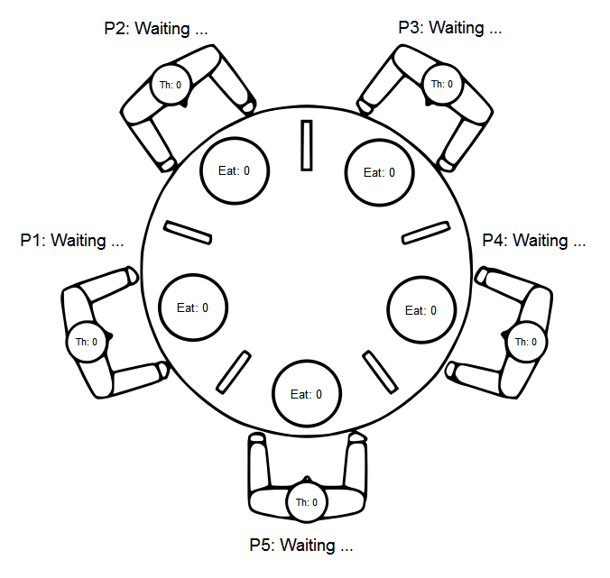

<a name="top-anchor"/>

| [Contents](../README.md#table-of-contents) | [Overview](../README.md#scxml-overview) | [Examples](../Examples/README.md) | [Editor](https://alexzhornyak.github.io/ScxmlEditor-Tutorial/) | [Forum](https://github.com/alexzhornyak/SCXML-tutorial/discussions) |
|---|---|---|---|---|

# [\<invoke\>](https://www.w3.org/TR/scxml/#invoke)
The element is used to create an instance of an external service (for example: nested state machine)

### Simple Example
Suppose you have multiple blocks with the same state machine logic

#### 1. Unoptimized statechart without \<invoke\>


<details><summary><b>Source code</b></summary>
<p>
  
```xml
<scxml datamodel="lua" name="ScxmlInvokeSimple" version="1.0" xmlns="http://www.w3.org/2005/07/scxml">
	<state id="State_1" initial="Off_1">
		<onexit>
			<cancel sendid="ID.Do.Timer"/>
		</onexit>
		<transition event="Go.Next" target="State_2"/>
		<state id="Off_1">
			<onentry>
				<send delay="1s" event="Do.Timer" id="ID.Do.Timer"/>
				<log expr="'OFF ' .. 1" label="INFO"/>
			</onentry>
			<transition event="Do.Timer" target="On_1"/>
		</state>
		<state id="On_1">
			<onentry>
				<send delay="1s" event="Do.Timer" id="ID.Do.Timer"/>
				<log expr="'ON ' .. 1" label="INFO"/>
			</onentry>
			<transition event="Do.Timer" target="Off_1"/>
		</state>
	</state>
	<state id="State_2" initial="Off_2">
		<onexit>
			<cancel sendid="ID.Do.Timer"/>
		</onexit>
		<transition event="Go.Next" target="State_3"/>
		<state id="Off_2">
			<onentry>
				<send delay="1s" event="Do.Timer" id="ID.Do.Timer"/>
				<log expr="'OFF ' .. 2" label="INFO"/>
			</onentry>
			<transition event="Do.Timer" target="On_2"/>
		</state>
		<state id="On_2">
			<onentry>
				<send delay="1s" event="Do.Timer" id="ID.Do.Timer"/>
				<log expr="'ON ' .. 2" label="INFO"/>
			</onentry>
			<transition event="Do.Timer" target="Off_2"/>
		</state>
	</state>
	<state id="State_3" initial="Off_3">
		<onexit>
			<cancel sendid="ID.Do.Timer"/>
		</onexit>
		<transition event="Go.Next" target="State_4"/>
		<state id="Off_3">
			<onentry>
				<send delay="1s" event="Do.Timer" id="ID.Do.Timer"/>
				<log expr="'OFF ' .. 3" label="INFO"/>
			</onentry>
			<transition event="Do.Timer" target="On_3"/>
		</state>
		<state id="On_3">
			<onentry>
				<send delay="1s" event="Do.Timer" id="ID.Do.Timer"/>
				<log expr="'ON ' .. 3" label="INFO"/>
			</onentry>
			<transition event="Do.Timer" target="Off_3"/>
		</state>
	</state>
	<state id="State_4" initial="Off_4">
		<onexit>
			<cancel sendid="ID.Do.Timer"/>
		</onexit>
		<transition event="Go.Next" target="State_1"/>
		<state id="Off_4">
			<onentry>
				<send delay="1s" event="Do.Timer" id="ID.Do.Timer"/>
				<log expr="'OFF ' .. 4" label="INFO"/>
			</onentry>
			<transition event="Do.Timer" target="On_4"/>
		</state>
		<state id="On_4">
			<onentry>
				<send delay="1s" event="Do.Timer" id="ID.Do.Timer"/>
				<log expr="'ON ' .. 4" label="INFO"/>
			</onentry>
			<transition event="Do.Timer" target="Off_4"/>
		</state>
	</state>
</scxml>
```

</p></details>

You may put similar logic into external state machine, define params which should be passed from the main state machine. And then you may create multiple instances using **\<invoke\>** element. You just need to path individual parameters for each external state machine

#### 2. Optimized statechart with \<invoke\>


<details><summary><b>Source code - main.scxml</b></summary>
<p>
  
```xml
<scxml datamodel="lua" name="ScxmlInvokeSimple" version="1.0" xmlns="http://www.w3.org/2005/07/scxml">
	<state id="State_1">
		<invoke src="Invoked.scxml">
			<param expr="1" name="i_ID"/>
		</invoke>
		<transition event="Go.Next" target="State_2"/>
	</state>
	<state id="State_2">
		<invoke src="Invoked.scxml">
			<param expr="2" name="i_ID"/>
		</invoke>
		<transition event="Go.Next" target="State_3"/>
	</state>
	<state id="State_3">
		<invoke src="Invoked.scxml">
			<param expr="3" name="i_ID"/>
		</invoke>
		<transition event="Go.Next" target="State_4"/>
	</state>
	<state id="State_4">
		<invoke src="Invoked.scxml">
			<param expr="4" name="i_ID"/>
		</invoke>
		<transition event="Go.Next" target="State_1"/>
	</state>
</scxml>
```

</p></details>

<details><summary><b>Source code - invoked.scxml</b></summary>
<p>
  
```xml
<scxml datamodel="lua" name="ScxmlInvoked" version="1.0" xmlns="http://www.w3.org/2005/07/scxml">
	<datamodel>
		<data expr="0" id="i_ID"/>
	</datamodel>
	<state id="State" initial="Off">
		<onexit>
			<cancel sendid="ID.Do.Timer"/>
		</onexit>
		<state id="Off">
			<onentry>
				<send delay="1s" event="Do.Timer" id="ID.Do.Timer"/>
				<log expr="'OFF ' ..  i_ID" label="INFO"/>
			</onentry>
			<transition event="Do.Timer" target="On"/>
		</state>
		<state id="On">
			<onentry>
				<send delay="1s" event="Do.Timer" id="ID.Do.Timer"/>
				<log expr="'ON ' .. i_ID" label="INFO"/>
			</onentry>
			<transition event="Do.Timer" target="Off"/>
		</state>
	</state>
</scxml>
```

</p></details>

## Attribute Details

### 1. 'type'
A URI specifying the type of the external service. Valid values are **http://www.w3.org/TR/scxml/ (Default)**, http://www.w3.org/TR/ccxml/, http://www.w3.org/TR/voicexml30/, http://www.w3.org/TR/voicexml21/ plus other platform-specific values. Must not occur with the 'typeexpr' attribute.

### 2. 'typeexpr'
Any value expression that evaluates to a URI that would be a valid value for 'type'. A dynamic alternative to 'type'. If this attribute is present, the SCXML Processor must evaluate it when the parent <invoke> element is evaluated and treat the result as if it had been entered as the value of 'type'. Must not occur with the 'type' attribute.

### 3. 'src'
A URI to be passed to the external service. Must not occur with the 'srcexpr' attribute or the [\<content\>](content.md) element.
```xml
<state id="Parent">
	<invoke src="Child.scxml" />
</state>
```

### 4. 'srcexpr'
Any expression evaluating to a valid URI. A dynamic alternative to 'src'. If this attribute is present, the SCXML Processor must evaluate it when the parent <invoke> element is evaluated and treat the result as if it had been entered as the value of 'src'. Must not occur with the 'src' attribute or the <content> element.
```xml
<state id="Parent">
	<invoke srcexpr="s_APP_PATH + 'Child.scxml'" />
</state>
```

### 5. 'id'
A string literal to be used as the identifier for this instance of \<invoke\>. Must not occur with the 'idlocation' attribute.
```xml
<state id="Parent">
	<invoke id="ID_MODULE_CHILD" src="Child.scxml" autoforward="false" />
	<onentry>
		<!-- invoked session with id 'ID_MODULE_CHILD' will receive event 'Timeout' after 2 seconds -->
		<send delay="2s" event="Timeout" target="#_ID_MODULE_CHILD"/>
	</onentry>
</state>
```

### 6. 'idlocation'
Any valid data model expression evaluating to a data model location. See [5.9.2 Location Expressions](https://www.w3.org/TR/scxml/#LocationExpressions) for details. Must not occur with the 'id' attribute.

### 7. 'namelist'
A space-separated list of one or more data model locations to be passed as attribute/value pairs to the invoked service. (The name of the location is the attribute and the value stored at the location is the value.). Must not occur with the \<param\> element.

### 8. 'autoforward'
A boolean flag indicating whether to forward events to the invoked process. Default value is **'false'**.
```xml
<state id="Parent">
	<invoke src="Child1.scxml" autoforward="true" />
	<invoke src="Child2.scxml" autoforward="true" />
	<invoke src="Child3.scxml" autoforward="true" />
	<onentry>
		<!-- all invoked sessions with 'autoforward=true' will receive event 'Timeout' after 2 seconds -->
		<send delay="2s" event="Timeout" />
	</onentry>
</state>
```

> NOTE: Autoforwared events may cause circlular event loops. To prevent this you need to disable autoforward and send events by submachine ID

> In the example below parent and child machine will generate the same events and we need to convince that they do not affect each other

**parent.scxml**


**child.scxml**


**Output:**
```
[Log] CHILD COUNT: 0
[Log] PARENT COUNT: 0
[Log] CHILD COUNT: 1
[Log] PARENT COUNT: 1
[Log] CHILD COUNT: 2
[Log] PARENT COUNT: 2
[Log] CHILD COUNT: 3
[Log] PARENT COUNT: 3
...
```


## [Dining Philosophers Problem example](https://github.com/alexzhornyak/SCXML-tutorial/tree/master/Examples/Qt/DiningPhilosophers)
The example shows how to communicate between multiple invoked submachines
[](https://github.com/alexzhornyak/SCXML-tutorial/tree/master/Examples/Qt/DiningPhilosophers)


<details><summary><b>Source code - main.scxml</b></summary>
<p>
  
```xml
<scxml datamodel="ecmascript" name="ScxmlDiningPhilosophers" version="1.0" xmlns="http://www.w3.org/2005/07/scxml">
	<parallel id="DiningPhilosophers">
		<datamodel>
			<data expr="{ 'take.1':0, 'take.2':0, 'take.3':0, 'take.4':0, 'take.5':0 }" id="t_INPUTS"/>
			<data expr="[
  [1,5], /* Philosopher 1 */
  [2,1], /* Philosopher 2 */ 
  [3,2], /* Philosopher 3 */
  [4,3], /* Philosopher 4 */ 
  [5,4]  /* Philosopher 5 */   
]" id="t_HAND_COMPLIANCE"/>
			<data expr="1000" id="i_DELAY_THINK_EAT"/>
		</datamodel>
		<transition event="take.*">
			<script>t_INPUTS[_event.name] = _event.data</script>
		</transition>
		<transition event="taken.*">
			<foreach array="t_HAND_COMPLIANCE" index="complianceIndex" item="complianceItem">
				<foreach array="complianceItem" item="handItem">
					<if cond="handItem==parseInt(_event.name.replace('taken.',''))">
						<send eventexpr="_event.name" targetexpr="'#_ID_P_' + (complianceIndex + 1)">
							<content expr="_event.data"/>
						</send>
					</if>
				</foreach>
			</foreach>
		</transition>
		<transition event="update.delay">
			<foreach array="t_HAND_COMPLIANCE" index="nIndex" item="vItem">
				<send eventexpr="_event.name" targetexpr="'#_ID_P_' + (nIndex + 1)">
					<content expr="_event.data"/>
				</send>
			</foreach>
		</transition>
		<state id="Philosopher5" initial="P5_Thinking">
			<invoke id="ID_P_5" src="sub_dining_philosopher.scxml">
				<param expr="5" name="i_ID"/>
				<param expr="t_HAND_COMPLIANCE" name="t_HAND_COMPLIANCE"/>
				<param expr="i_DELAY_THINK_EAT" name="i_DELAY_THINK_EAT"/>
			</invoke>
			<state id="P5_Thinking">
				<transition cond="! (_event.data==1)" event="think.5" target="P5_Hungry"/>
			</state>
			<state id="P5_Hungry">
				<transition cond="_event.data==1" event="eat.5" target="P5_Eating"/>
				<transition cond="_event.data==1" event="think.5" target="P5_Thinking"/>
			</state>
			<state id="P5_Eating">
				<transition cond="! (_event.data==1)" event="eat.5" target="P5_Hungry"/>
			</state>
		</state>
		<state id="Philosopher4" initial="P4_Thinking">
			<invoke id="ID_P_4" src="sub_dining_philosopher.scxml">
				<param expr="4" name="i_ID"/>
				<param expr="t_HAND_COMPLIANCE" name="t_HAND_COMPLIANCE"/>
				<param expr="i_DELAY_THINK_EAT" name="i_DELAY_THINK_EAT"/>
			</invoke>
			<state id="P4_Thinking">
				<transition cond="! (_event.data==1)" event="think.4" target="P4_Hungry"/>
			</state>
			<state id="P4_Hungry">
				<transition cond="_event.data==1" event="eat.4" target="P4_Eating"/>
				<transition cond="_event.data==1" event="think.4" target="P4_Thinking"/>
			</state>
			<state id="P4_Eating">
				<transition cond="! (_event.data==1)" event="eat.4" target="P4_Hungry"/>
			</state>
		</state>
		<state id="Philosopher3" initial="P3_Thinking">
			<invoke id="ID_P_3" src="sub_dining_philosopher.scxml">
				<param expr="3" name="i_ID"/>
				<param expr="t_HAND_COMPLIANCE" name="t_HAND_COMPLIANCE"/>
				<param expr="i_DELAY_THINK_EAT" name="i_DELAY_THINK_EAT"/>
			</invoke>
			<state id="P3_Thinking">
				<transition cond="! (_event.data==1)" event="think.3" target="P3_Hungry"/>
			</state>
			<state id="P3_Eating">
				<transition cond="! (_event.data==1)" event="eat.3" target="P3_Hungry"/>
			</state>
			<state id="P3_Hungry">
				<transition cond="_event.data==1" event="eat.3" target="P3_Eating"/>
				<transition cond="_event.data==1" event="think.3" target="P3_Thinking"/>
			</state>
		</state>
		<state id="Philosopher2" initial="P2_Thinking">
			<invoke id="ID_P_2" src="sub_dining_philosopher.scxml">
				<param expr="2" name="i_ID"/>
				<param expr="t_HAND_COMPLIANCE" name="t_HAND_COMPLIANCE"/>
				<param expr="i_DELAY_THINK_EAT" name="i_DELAY_THINK_EAT"/>
			</invoke>
			<state id="P2_Thinking">
				<transition cond="! (_event.data==1)" event="think.2" target="P2_Hungry"/>
			</state>
			<state id="P2_Eating">
				<transition cond="! (_event.data==1)" event="eat.2" target="P2_Hungry"/>
			</state>
			<state id="P2_Hungry">
				<transition cond="_event.data==1" event="eat.2" target="P2_Eating"/>
				<transition cond="_event.data==1" event="think.2" target="P2_Thinking"/>
			</state>
		</state>
		<state id="Philosopher1" initial="P1_Thinking">
			<invoke id="ID_P_1" src="sub_dining_philosopher.scxml">
				<param expr="1" name="i_ID"/>
				<param expr="t_HAND_COMPLIANCE" name="t_HAND_COMPLIANCE"/>
				<param expr="i_DELAY_THINK_EAT" name="i_DELAY_THINK_EAT"/>
			</invoke>
			<state id="P1_Thinking">
				<transition cond="! (_event.data==1)" event="think.1" target="P1_Hungry"/>
			</state>
			<state id="P1_Hungry">
				<transition cond="_event.data==1" event="eat.1" target="P1_Eating"/>
				<transition cond="_event.data==1" event="think.1" target="P1_Thinking"/>
			</state>
			<state id="P1_Eating">
				<transition cond="! (_event.data==1)" event="eat.1" target="P1_Hungry"/>
			</state>
		</state>
		<state id="Fork4" initial="Fork4_Down">
			<state id="Fork4_Down">
				<transition cond="! (t_INPUTS['take.4']==0)" target="Fork4_Up"/>
			</state>
			<state id="Fork4_Up">
				<onentry>
					<send event="taken.4">
						<content expr="t_INPUTS['take.4']"/>
					</send>
				</onentry>
				<onexit>
					<send event="taken.4">
						<content expr="0"/>
					</send>
				</onexit>
				<transition cond="t_INPUTS['take.4']==0" target="Fork4_Down"/>
			</state>
		</state>
		<state id="Fork5" initial="Fork5_Down">
			<state id="Fork5_Down">
				<transition cond="! (t_INPUTS['take.5']==0)" target="Fork5_Up"/>
			</state>
			<state id="Fork5_Up">
				<onentry>
					<send event="taken.5">
						<content expr="t_INPUTS['take.5']"/>
					</send>
				</onentry>
				<onexit>
					<send event="taken.5">
						<content expr="0"/>
					</send>
				</onexit>
				<transition cond="t_INPUTS['take.5']==0" target="Fork5_Down"/>
			</state>
		</state>
		<state id="Fork3" initial="Fork3_Down">
			<state id="Fork3_Down">
				<transition cond="! (t_INPUTS['take.3']==0)" target="Fork3_Up"/>
			</state>
			<state id="Fork3_Up">
				<onentry>
					<send event="taken.3">
						<content expr="t_INPUTS['take.3']"/>
					</send>
				</onentry>
				<onexit>
					<send event="taken.3">
						<content expr="0"/>
					</send>
				</onexit>
				<transition cond="t_INPUTS['take.3']==0" target="Fork3_Down"/>
			</state>
		</state>
		<state id="Fork2" initial="Fork2_Down">
			<state id="Fork2_Down">
				<transition cond="! (t_INPUTS['take.2']==0)" target="Fork2_Up"/>
			</state>
			<state id="Fork2_Up">
				<onentry>
					<send event="taken.2">
						<content expr="t_INPUTS['take.2']"/>
					</send>
				</onentry>
				<onexit>
					<send event="taken.2">
						<content expr="0"/>
					</send>
				</onexit>
				<transition cond="t_INPUTS['take.2']==0" target="Fork2_Down"/>
			</state>
		</state>
		<state id="Fork1" initial="Fork1_Down">
			<state id="Fork1_Down">
				<transition cond="! (t_INPUTS['take.1']==0)" target="Fork1_Up"/>
			</state>
			<state id="Fork1_Up">
				<onentry>
					<send event="taken.1">
						<content expr="t_INPUTS['take.1']"/>
					</send>
				</onentry>
				<onexit>
					<send event="taken.1">
						<content expr="0"/>
					</send>
				</onexit>
				<transition cond="t_INPUTS['take.1']==0" target="Fork1_Down"/>
			</state>
		</state>
	</parallel>
</scxml>
```

</p></details>

 

<details><summary><b>Source code - invoked.scxml</b></summary>
<p>
  
```xml
<scxml datamodel="ecmascript" initial="Philospher" name="ScxmlPhilospher" version="1.0" xmlns="http://www.w3.org/2005/07/scxml">
	<datamodel><!--Passed from parent-->
		<data expr="0" id="i_ID"/>
		<data expr="0" id="i_ID_LEFT"/>
		<data expr="0" id="i_ID_RIGHT"/>
		<data expr="[
  [1,5], /* Philosopher 1 */
  [2,1], /* Philosopher 2 */ 
  [3,2], /* Philosopher 3 */
  [4,3], /* Philosopher 4 */ 
  [5,4]  /* Philosopher 5 */   
]" id="t_HAND_COMPLIANCE"/>
		<data expr="1000" id="i_DELAY_THINK_EAT"/><!--Local-->
		<data expr="{}" id="t_INPUTS"/>
		<data expr="0" id="i_EAT_COUNT"/>
	</datamodel>
	<state id="Philospher" initial="Thinking">
		<onentry>
			<script>if (i_ID !== 0) {
    i_ID_LEFT = t_HAND_COMPLIANCE[i_ID - 1][0]
    i_ID_RIGHT = t_HAND_COMPLIANCE[i_ID - 1][1]
}

t_INPUTS['taken.' + i_ID_LEFT] = 0
t_INPUTS['taken.' + i_ID_RIGHT] = 0
			</script>
		</onentry>
		<transition cond="(_event.name == ('taken.' + i_ID_LEFT)) ||
(_event.name == ('taken.' + i_ID_RIGHT))" event="taken.*">
			<script>t_INPUTS[_event.name] = _event.data</script>
			<send eventexpr="'do.' + _event.name"/>
		</transition>
		<transition event="error.*" target="FinalSub"/>
		<transition event="update.delay">
			<assign expr="_event.data" location="i_DELAY_THINK_EAT"/>
		</transition>
		<state id="Eating">
			<onentry>
				<send eventexpr="'eat.' + i_ID" target="#_parent">
					<content expr="1"/>
				</send>
				<send delayexpr="i_DELAY_THINK_EAT + 'ms'" event="Do.Timer.Think" id="ID.Do.Timer.Think"/>
				<assign expr="i_EAT_COUNT + 1" location="i_EAT_COUNT"/>
				<log expr="'Philosopher: ' + i_ID + ' Count: ' + i_EAT_COUNT" label="EATING"/>
			</onentry>
			<onexit>
				<send eventexpr="'eat.' + i_ID" target="#_parent">
					<content expr="0"/>
				</send>
				<cancel sendid="ID.Do.Timer.Think"/>
			</onexit>
			<state id="RightTaken1">
				<transition event="Do.Timer.Think" target="RequirePutLeft"/>
			</state>
			<state id="LeftTaken1">
				<transition event="Do.Timer.Think" target="RequirePutRight"/>
			</state>
			<state id="LeftPut1">
				<onentry>
					<send eventexpr="'take.' + i_ID_LEFT" target="#_parent">
						<content expr="0"/>
					</send>
				</onentry>
				<state id="RequirePutRight">
					<transition cond="t_INPUTS['taken.'+i_ID_LEFT]==0" target="PutLeftComplete"/>
				</state>
				<state id="PutRightComplete">
					<transition cond="t_INPUTS['taken.'+i_ID_LEFT]==0" target="Thinking"/>
				</state>
			</state>
			<state id="RightPut1">
				<onentry>
					<send eventexpr="'take.' + i_ID_RIGHT" target="#_parent">
						<content expr="0"/>
					</send>
				</onentry>
				<state id="RequirePutLeft">
					<transition cond="t_INPUTS['taken.'+i_ID_RIGHT]==0" target="PutRightComplete"/>
				</state>
				<state id="PutLeftComplete">
					<transition cond="t_INPUTS['taken.'+i_ID_RIGHT]==0" target="Thinking"/>
				</state>
			</state>
		</state>
		<state id="Thinking">
			<onentry>
				<send delayexpr="i_DELAY_THINK_EAT + 'ms'" event="Do.Timer.Hungry" id="ID.Do.Timer.Hungry"/>
				<send eventexpr="'think.' + i_ID" target="#_parent">
					<content expr="1"/>
				</send>
			</onentry>
			<onexit>
				<send eventexpr="'think.' + i_ID" target="#_parent">
					<content expr="0"/>
				</send>
				<cancel sendid="ID.Do.Timer.Hungry"/>
			</onexit>
			<transition event="Do.Timer.Hungry" target="ProcessHungry"/>
		</state>
		<state id="ProcessHungry" initial="Hungry">
			<state id="Hungry">
				<transition cond="t_INPUTS['taken.'+i_ID_LEFT]==0" target="LeftWaiting"/>
				<transition cond="t_INPUTS['taken.'+i_ID_RIGHT]==0" target="RightWaiting"/>
			</state>
			<state id="LeftWaiting">
				<onentry>
					<send eventexpr="'take.' + i_ID_LEFT" target="#_parent">
						<content expr="i_ID"/>
					</send>
				</onentry>
				<transition cond="_event.name=='do.taken.' + i_ID_LEFT" event="do.taken.*" target="LeftCheck"/>
			</state>
			<state id="RightWaiting">
				<onentry>
					<send eventexpr="'take.' + i_ID_RIGHT" target="#_parent">
						<content expr="i_ID"/>
					</send>
				</onentry>
				<transition cond="_event.name=='do.taken.' + i_ID_RIGHT" event="do.taken.*" target="RightCheck"/>
			</state>
			<state id="LeftCheck">
				<transition cond="t_INPUTS['taken.'+i_ID_LEFT]==i_ID" target="LeftTaken"/>
				<transition cond="t_INPUTS['taken.'+i_ID_RIGHT]==i_ID" target="RightPut"/>
				<transition target="RightWaiting"/>
			</state>
			<state id="RightCheck">
				<transition cond="t_INPUTS['taken.'+i_ID_RIGHT]==i_ID" target="RightTaken"/>
				<transition cond="t_INPUTS['taken.'+i_ID_LEFT]==i_ID" target="LeftPut"/>
				<transition target="LeftWaiting"/>
			</state>
			<state id="LeftTaken">
				<transition cond="t_INPUTS['taken.'+i_ID_RIGHT]==i_ID" target="RightTaken1"/>
				<transition cond="t_INPUTS['taken.'+i_ID_RIGHT]==0" target="RightWaiting"/>
				<transition target="LeftPut"/>
			</state>
			<state id="LeftPut">
				<onentry>
					<send eventexpr="'take.' + i_ID_LEFT" target="#_parent">
						<content expr="0"/>
					</send>
				</onentry>
				<transition cond="t_INPUTS['taken.'+i_ID_LEFT]==0" target="Hungry"/>
			</state>
			<state id="RightTaken">
				<transition cond="t_INPUTS['taken.'+i_ID_LEFT]==i_ID" target="LeftTaken1"/>
				<transition cond="t_INPUTS['taken.'+i_ID_LEFT]==0" target="LeftWaiting"/>
				<transition target="RightPut"/>
			</state>
			<state id="RightPut">
				<onentry>
					<send eventexpr="'take.' + i_ID_RIGHT" target="#_parent">
						<content expr="0"/>
					</send>
				</onentry>
				<transition cond="t_INPUTS['taken.'+i_ID_RIGHT]==0" target="Hungry"/>
			</state>
		</state>
	</state>
	<final id="FinalSub"/>
</scxml>
```

</p></details>

### [Qt SCXML CPP Invoke Demo](../Examples/Qt/TestInvokeCpp)
Qt widget-based application that demonstrates how to invoke child state machines with **QScxmlCppDataModel**


## [W3C IRP tests](https://www.w3.org/Voice/2013/scxml-irp)

Number|Name and link|Source|
---|---|---|
1|[Test 215](invoke.md#1-test-215)|https://www.w3.org/Voice/2013/scxml-irp/215/test215.txml
2|[Test 216](invoke.md#2-test-216)|https://www.w3.org/Voice/2013/scxml-irp/216/test216.txml
3|[Test 220](invoke.md#3-test-220)|https://www.w3.org/Voice/2013/scxml-irp/220/test220.txml
4|[Test 223](invoke.md#4-test-223)|https://www.w3.org/Voice/2013/scxml-irp/223/test223.txml
5|[Test 224](invoke.md#5-test-224)|https://www.w3.org/Voice/2013/scxml-irp/224/test224.txml
6|[Test 225](invoke.md#6-test-225)|https://www.w3.org/Voice/2013/scxml-irp/225/test225.txml
7|[Test 226](invoke.md#7-test-226)|https://www.w3.org/Voice/2013/scxml-irp/226/test226.txml
8|[Test 228](invoke.md#8-test-228)|https://www.w3.org/Voice/2013/scxml-irp/228/test228.txml
9|[Test 229](invoke.md#9-test-229)|https://www.w3.org/Voice/2013/scxml-irp/229/test229.txml
10|[Test 230](invoke.md#10-test-230)|https://www.w3.org/Voice/2013/scxml-irp/230/test230.txml
11|[Test 232](invoke.md#11-test-232)|https://www.w3.org/Voice/2013/scxml-irp/232/test232.txml
12|[Test 233](invoke.md#12-test-233)|https://www.w3.org/Voice/2013/scxml-irp/233/test233.txml
13|[Test 234](invoke.md#13-test-234)|https://www.w3.org/Voice/2013/scxml-irp/234/test234.txml
14|[Test 235](invoke.md#14-test-235)|https://www.w3.org/Voice/2013/scxml-irp/235/test235.txml
15|[Test 236](invoke.md#15-test-236)|https://www.w3.org/Voice/2013/scxml-irp/236/test236.txml
16|[Test 237](invoke.md#16-test-237)|https://www.w3.org/Voice/2013/scxml-irp/237/test237.txml
17|[Test 239](invoke.md#17-test-239)|https://www.w3.org/Voice/2013/scxml-irp/239/test239.txml
18|[Test 240](invoke.md#18-test-240)|https://www.w3.org/Voice/2013/scxml-irp/240/test240.txml
19|[Test 241](invoke.md#19-test-241)|https://www.w3.org/Voice/2013/scxml-irp/241/test241.txml
20|[Test 242](invoke.md#20-test-242)|https://www.w3.org/Voice/2013/scxml-irp/242/test242.txml
21|[Test 243](invoke.md#21-test-243)|https://www.w3.org/Voice/2013/scxml-irp/243/test243.txml
22|[Test 244](invoke.md#22-test-244)|https://www.w3.org/Voice/2013/scxml-irp/244/test244.txml
23|[Test 245](invoke.md#23-test-245)|https://www.w3.org/Voice/2013/scxml-irp/245/test245.txml
24|[Test 247](invoke.md#24-test-247)|https://www.w3.org/Voice/2013/scxml-irp/247/test247.txml
25|[Test 250](invoke.md#25-test-250)|https://www.w3.org/Voice/2013/scxml-irp/250/test250.txml
26|[Test 252](invoke.md#26-test-252)|https://www.w3.org/Voice/2013/scxml-irp/252/test252.txml
27|[Test 253](invoke.md#27-test-253)|https://www.w3.org/Voice/2013/scxml-irp/253/test253.txml
28|[Test 530](invoke.md#28-test-530)|https://www.w3.org/Voice/2013/scxml-irp/530/test530.txml
29|[Test 554](invoke.md#29-test-554)|https://www.w3.org/Voice/2013/scxml-irp/554/test554.txml

### [1. Test 215](https://www.w3.org/Voice/2013/scxml-irp/215/test215.txml)
If the 'typeexpr' attribute is present, the SCXML Processor MUST evaluate it when the parent invoke element is evaluated and treat the result as if it had been entered as the value of 'type'.


### [2. Test 216](https://www.w3.org/Voice/2013/scxml-irp/216/test216.txml)
If the srcexpr attribute is present, the SCXML Processor MUST evaluate it when the parent invoke element is evaluated and treat the result as if it had been entered as the value of 'src'.


### [3. Test 220](https://www.w3.org/Voice/2013/scxml-irp/220/test220.txml)
Platforms MUST support http://www.w3.org/TR/scxml/, as a value for the 'type' attribute.


### [4. Test 223](https://www.w3.org/Voice/2013/scxml-irp/223/test223.txml)
If the 'idlocation' attribute is present, the SCXML Processor MUST generate an id automatically when the invoke element is evaluated and store it in the location specified by 'idlocation'.


### [5. Test 224](https://www.w3.org/Voice/2013/scxml-irp/224/test224.txml)
When the platform generates an identifier for 'idlocation', the identifier MUST have the form **stateid.platformid**, where **stateid** is the id of the state containing this element and **platformid** is automatically generated.


### [6. Test 225](https://www.w3.org/Voice/2013/scxml-irp/225/test225.txml)
In the automatically generated invoke identifier, **platformid** MUST be unique within the current session.


### [7. Test 226](https://www.w3.org/Voice/2013/scxml-irp/226/test226.txml)
When the invoke element is executed, the SCXML Processor MUST start a new logical instance of the external service specified in 'type' or 'typexpr', passing it the URL specified by 'src' or the data specified by [\<content\>](content.md), or [\<param\>](param.md).


### [8. Test 228](https://www.w3.org/Voice/2013/scxml-irp/228/test228.txml)
The Processor MUST keep track of the unique invokeid and insure that it is included in all events that the invoked service returns to the invoking session.


### [9. Test 229](https://www.w3.org/Voice/2013/scxml-irp/229/test229.txml)
When the 'autoforward' attribute is set to true, the SCXML Processor MUST send an exact copy of every external event it receives to the invoked process.


### [10. Test 230](https://www.w3.org/Voice/2013/scxml-irp/230/test230.txml)
When the SCXML Processor autoforwards an event to the invoked process, all the fields specified in [5.10.1 The Internal Structure of Events](https://www.w3.org/TR/scxml/#SystemVariables) MUST have the same values in the forwarded copy of the event.


**Output:**
```
External Event: childToParent, interpreter [Scxml_Test230]
[Log] name is : "childToParent"
[Log] type is : "external"
[Log] sendid is : nil
External Event: childToParent, interpreter [ScxmlChild]
[Log] origin is : "#_scxml_35ebd509-4b45-419f-b021-3df9060f38cf"
[Log] origintype is : "http://www.w3.org/TR/scxml/#SCXMLEventProcessor"
[Log] name is : "childToParent"
[Log] invokeid is : "s0.3b6c2a1a-8bdf-42fe-bc0d-386cd510bf74"
[Log] type is : "external"
[Log] data is : nil
[Log] sendid is : nil
[Log] origin is : "#_scxml_35ebd509-4b45-419f-b021-3df9060f38cf"
[Log] origintype is : "http://www.w3.org/TR/scxml/#SCXMLEventProcessor"
[Log] invokeid is : "s0.3b6c2a1a-8bdf-42fe-bc0d-386cd510bf74"
[Log] data is : nil
Platform Event: done.invoke.s0.3b6c2a1a-8bdf-42fe-bc0d-386cd510bf74, interpreter [Scxml_Test230]
```

### [11. Test 232](https://www.w3.org/Voice/2013/scxml-irp/232/test232.txml)
The invoked external service MAY return multiple events while it is processing.


### [12. Test 233](https://www.w3.org/Voice/2013/scxml-irp/233/test233.txml)
If there is a finalize handler in the instance of invoke that created the service that generated the event, the SCXML Processor MUST execute the code in that finalize handler right before it removes the event from the event queue for processing.


### [13. Test 234](https://www.w3.org/Voice/2013/scxml-irp/234/test234.txml)
It MUST NOT execute the finalize handler in any other instance of invoke besides the one in the instance of invoke that created the service that generated the event.
  

  


### [14. Test 235](https://www.w3.org/Voice/2013/scxml-irp/235/test235.txml)
Once the invoked external service has finished processing it MUST return a special event 'done.invoke.id' to the external event queue of the invoking process, where id is the invokeid for the corresponding invoke element.


### [15. Test 236](https://www.w3.org/Voice/2013/scxml-irp/236/test236.txml)
The external service MUST NOT generate any other events after the invoke.done.invokeid event.


### [16. Test 237](https://www.w3.org/Voice/2013/scxml-irp/237/test237.txml)
If the invoking session takes a transition out of the state containing the invoke before it receives the 'done.invoke.id' event, the SCXML Processor MUST automatically cancel the invoked component and stop its processing.


### [17. Test 239](https://www.w3.org/Voice/2013/scxml-irp/239/test239.txml)
Invoked services of type **http://www.w3.org/TR/scxml/**, **http://www.w3.org/TR/ccxml/**, **http://www.w3.org/TR/voicexml30/**, or **http://www.w3.org/TR/voicexml21** MUST interpret values specified by the content element or 'src' attribute as markup to be executed.


### [18. Test 240](https://www.w3.org/Voice/2013/scxml-irp/240/test240.txml)
Invoked services of type **http://www.w3.org/TR/scxml/**, **http://www.w3.org/TR/ccxml/**, **http://www.w3.org/TR/voicexml30/**, or **http://www.w3.org/TR/voicexml21** MUST interpret values specified by [param element](param.md) or 'namelist' attribute as values that are to be injected into their data models.


### [19. Test 241](https://www.w3.org/Voice/2013/scxml-irp/241/test241.txml)
Invoked services MUST treat values specified by [param](param.md) and namelist identically.


### [20. Test 242](https://www.w3.org/Voice/2013/scxml-irp/242/test242.txml)
Invoked services MUST also treat values specified by 'src' and [content](content.md) identically.


### [21. Test 243](https://www.w3.org/Voice/2013/scxml-irp/243/test243.txml)
If the invoked process is of type http://www.w3.org/TR/scxml/ and 'name' of a [param element](param.md) in the invoke matches the 'id' of a [data element](datamodel.md#data) in the top-level data declarations of the invoked session, the SCXML Processor MUST use the value of the [param element](param.md) as the initial value of the corresponding [data element](datamodel.md#data).


### [22. Test 244](https://www.w3.org/Voice/2013/scxml-irp/244/test244.txml)
If the invoked process is of type http://www.w3.org/TR/scxml/ and the key of namelist item in the invoke matches the 'id' of a [data element](datamodel.md#data) in the top-level data declarations of the invoked session, the SCXML Processor MUST use the corresponding value as the initial value of the corresponding [data element](datamodel.md#data).


### [23. Test 245](https://www.w3.org/Voice/2013/scxml-irp/245/test245.txml)
If the invoked process is of type **http://www.w3.org/TR/scxml/**, and the name of a [param element](param.md) or the key of a namelist item do not match the name of a [data element](datamodel.md#data) in the invoked process, the Processor MUST NOT add the value of the [param element](param.md) or namelist key/value pair to the invoked session's [data model](datamodel.md).


### [24. Test 247](https://www.w3.org/Voice/2013/scxml-irp/247/test247.txml)
If the invoked state machine is of type **http://www.w3.org/TR/scxml/** and it reaches a top-level final state, the Processor MUST place the event **done.invoke.id** on the external event queue of the invoking machine, where id is the invokeid for this invocation.


### [25. Test 250](https://www.w3.org/Voice/2013/scxml-irp/250/test250.txml)
When an invoked process of type **http://www.w3.org/TR/scxml/** is cancelled by the invoking process, the Processor MUST execute the [onexit](onexit.md) handlers for all active states in the invoked session.


**Output:**
```
External Event: foo, interpreter [Scxml_Test250]
[Log] "Exiting sub01"
[Log] "Exiting sub0"
```

### [26. Test 252](https://www.w3.org/Voice/2013/scxml-irp/252/test252.txml)
Once it cancels an invoked session, the Processor MUST NOT insert any events it receives from the invoked session into the external event queue of the invoking session.


### [27. Test 253](https://www.w3.org/Voice/2013/scxml-irp/253/test253.txml)
When the invoked session is of type **http://www.w3.org/TR/scxml/**, The SCXML Processor MUST support the use of [SCXML Event/IO processor](https://www.w3.org/TR/scxml/#SCXMLEventProcessor) to communicate between the invoking and the invoked sessions.


### [28. Test 530](https://www.w3.org/Voice/2013/scxml-irp/530/test530.txml)
The SCXML Processor MUST evaluate a child [content element](content.md) when the parent invoke element is evaluated and pass the resulting data to the invoked service.


### [29. Test 554](https://www.w3.org/Voice/2013/scxml-irp/554/test554.txml)
If the evaluation of the invoke element's arguments produces an error, the SCXML Processor MUST terminate the processing of the element without further action.


| [TOP](#top-anchor) | [Contents](../README.md#table-of-contents) | [Overview](../README.md#scxml-overview) | [Examples](../Examples/README.md) | [Editor](https://alexzhornyak.github.io/ScxmlEditor-Tutorial/) | [Forum](https://github.com/alexzhornyak/SCXML-tutorial/discussions) |
|---|---|---|---|---|---|
