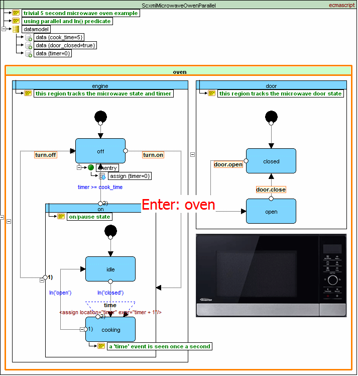

<a name="top-anchor"/>

| [Contents](../README.md#table-of-contents) | [Overview](../README.md#scxml-overview) | [Examples](../README.md#examples) | [Forum](https://github.com/alexzhornyak/SCXML-tutorial/discussions) |

# [Microwave owen (using parallel) example](https://www.w3.org/TR/scxml/#N11619)
The example below shows the implementation of a simple microwave oven using [**\<parallel\>**](parallel.md) and the SCXML **In()** predicate.



```xml
<scxml datamodel="ecmascript" initial="oven" name="ScxmlMicrowaveOwenParallel" version="1.0" xmlns="http://www.w3.org/2005/07/scxml">
	<datamodel>
		<data expr="5" id="cook_time"/>
		<data expr="true" id="door_closed"/>
		<data expr="0" id="timer"/>
	</datamodel>
	<parallel id="oven">
		<state id="engine">
			<initial>
				<transition target="off"/>
			</initial>
			<state id="off">
				<onentry>
					<assign expr="0" location="timer"/>
				</onentry>
				<transition event="turn.on" target="on"/>
			</state>
			<state id="on">
				<transition event="turn.off" target="off"/>
				<transition cond="timer &gt;= cook_time" target="off"/>
				<initial>
					<transition target="idle"/>
				</initial>
				<state id="idle">
					<transition cond="In('closed')" target="cooking"/>
				</state>
				<state id="cooking">
					<transition cond="In('open')" target="idle"/>
					<transition event="time">
						<assign location="timer" expr="timer + 1"/>
					</transition>
				</state>
			</state>
		</state>
		<state id="door">
			<initial>
				<transition target="closed"/>
			</initial>
			<state id="closed">
				<transition event="door.open" target="open"/>
			</state>
			<state id="open">
				<transition event="door.close" target="closed"/>
			</state>
		</state>
	</parallel>
</scxml>
```

| [TOP](#top-anchor) | [Contents](../README.md#table-of-contents) | [Overview](../README.md#scxml-overview) | [Examples](../README.md#examples) | [Forum](https://github.com/alexzhornyak/SCXML-tutorial/discussions) |
