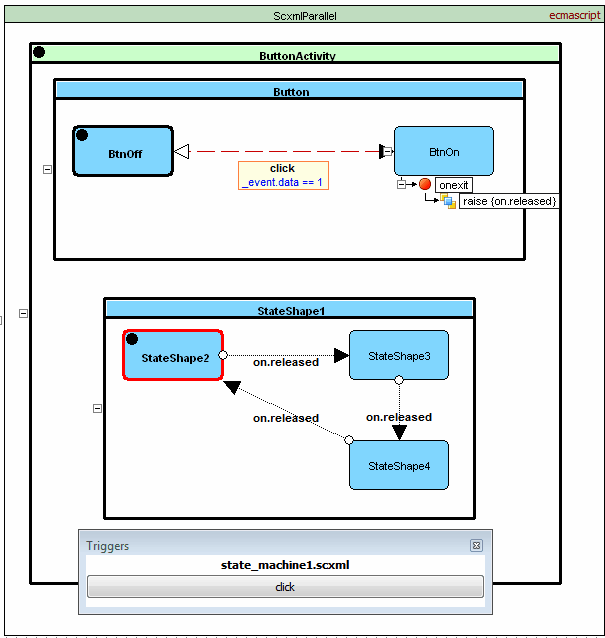

<a name="top-anchor"/>

| [Contents](../README.md#table-of-contents) | [Overview](../README.md#scxml-overview) | [Examples](../Examples/README.md) | [Editor](https://alexzhornyak.github.io/ScxmlEditor-Tutorial/) | [Forum](https://github.com/alexzhornyak/SCXML-tutorial/discussions) |
|---|---|---|---|---|

# [\<raise\>](https://www.w3.org/TR/scxml/#raise)

**[Video version](https://youtu.be/H4cdRghJKvk)**

The \<raise\> element raises an event in the current SCXML session. Note that the event will not be processed until the current block of executable content has completed and all events that are already in the internal event queue have been processed. For example, suppose the \<raise\> element occurs first in the [\<onentry\>](onentry.md) handler of state S followed by executable content elements ec1 and ec2. If event e1 is already in the internal event queue when S is entered, the event generated by \<raise\> will not be processed until ec1 and ec2 have finished execution and e1 has been processed.



<details><summary><b>Source code</b></summary>
<p>
  
```xml
<scxml datamodel="ecmascript" name="ScxmlParallel" version="1.0" xmlns="http://www.w3.org/2005/07/scxml">
	<parallel id="ButtonActivity">
		<state id="Button">
			<state id="BtnOff">
				<transition cond="_event.data == 1" event="click" target="BtnOn"/>
			</state>
			<state id="BtnOn">
				<onexit>
					<raise event="on.released"/>
				</onexit>
				<transition cond="! (_event.data == 1)" event="click" target="BtnOff"/>
			</state>
		</state>
		<state id="StateShape1">
			<state id="StateShape2">
				<transition event="on.released" target="StateShape3"/>
			</state>
			<state id="StateShape3">
				<transition event="on.released" target="StateShape4"/>
			</state>
			<state id="StateShape4">
				<transition event="on.released" target="StateShape2"/>
			</state>
		</state>
	</parallel>
</scxml>
```

</p></details>

---


```xml
<scxml initial="State1" name="Scxml" version="1.0" xmlns="http://www.w3.org/2005/07/scxml">
	<state id="State1">
		<onentry>
			<raise event="Quit"/>
			<log expr="Log element is after raise element, but is executed before!"/>
			<log expr="These log messages will be executed before &lt;raise&gt;!"/>
		</onentry>
		<transition event="Quit" target="End"/>
	</state>
	<final id="End"/>
</scxml>
```

**Output:**
> \[Log\] "Log element is after raise element, but is executed before!"
>
> \[Log\] "These log messages will be executed before \<raise\>!"
>
> Internal Event: Quit, interpreter \[Scxml\]

## [W3C IRP tests](https://www.w3.org/Voice/2013/scxml-irp)

### [Test 144](https://www.w3.org/Voice/2013/scxml-irp/144/test144.txml)
The SCXML processor MUST place the event that is generated by the raise element at the rear of the session's internal event queue.


| [TOP](#top-anchor) | [Contents](../README.md#table-of-contents) | [Overview](../README.md#scxml-overview) | [Examples](../Examples/README.md) | [Editor](https://alexzhornyak.github.io/ScxmlEditor-Tutorial/) | [Forum](https://github.com/alexzhornyak/SCXML-tutorial/discussions) |
|---|---|---|---|---|---|
