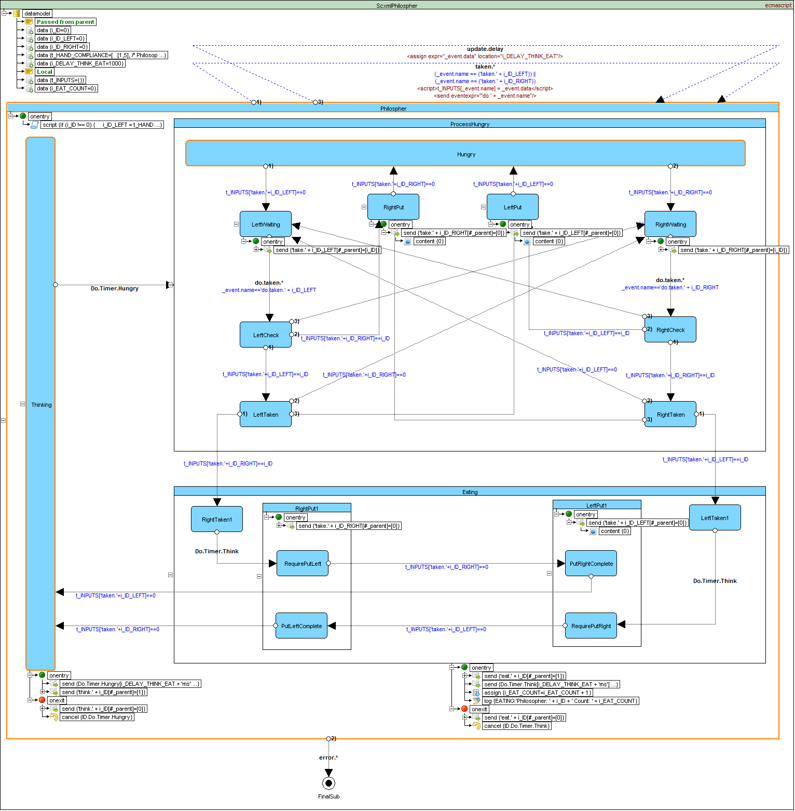

<a name="top-anchor"/>

| [Contents](../../../README.md#table-of-contents) | [Overview](../../../README.md#scxml-overview) | [Examples](../../README.md) | [Editor](https://alexzhornyak.github.io/ScxmlEditor-Tutorial/) | [Forum](https://github.com/alexzhornyak/SCXML-tutorial/discussions) |
|---|---|---|---|---|

# Dining philosophers problem (Qt SCXML EcmaScript)
In computer science, the dining philosophers problem is an example problem often used in concurrent algorithm design to illustrate synchronization issues and techniques for resolving them.

It was originally formulated in 1965 by Edsger Dijkstra as a student exam exercise, presented in terms of computers competing for access to tape drive peripherals. Soon after, Tony Hoare gave the problem its present formulation

## Problem statement
Five silent philosophers sit at a round table with bowls of spaghetti. Forks are placed between each pair of adjacent philosophers.

Each philosopher must alternately think and eat. However, a philosopher can only eat spaghetti when they have both left and right forks. Each fork can be held by only one philosopher and so a philosopher can use the fork only if it is not being used by another philosopher. After an individual philosopher finishes eating, they need to put down both forks so that the forks become available to others. A philosopher can only take the fork on their right or the one on their left as they become available and they cannot start eating before getting both forks.

Eating is not limited by the remaining amounts of spaghetti or stomach space; an infinite supply and an infinite demand are assumed.

The problem is how to design a discipline of behavior (a concurrent algorithm) such that no philosopher will starve; i.e., each can forever continue to alternate between eating and thinking, assuming that no philosopher can know when others may want to eat or think.

 

## SCXML Implementation
 

 

| [TOP](#top-anchor) | [Contents](../../../README.md#table-of-contents) | [Overview](../../../README.md#scxml-overview) | [Examples](../../README.md) | [Editor](https://alexzhornyak.github.io/ScxmlEditor-Tutorial/) | [Forum](https://github.com/alexzhornyak/SCXML-tutorial/discussions) |
|---|---|---|---|---|---|
