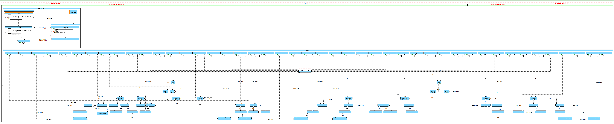
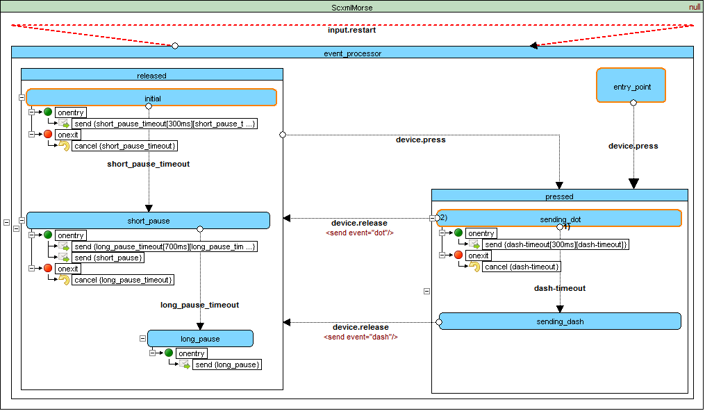
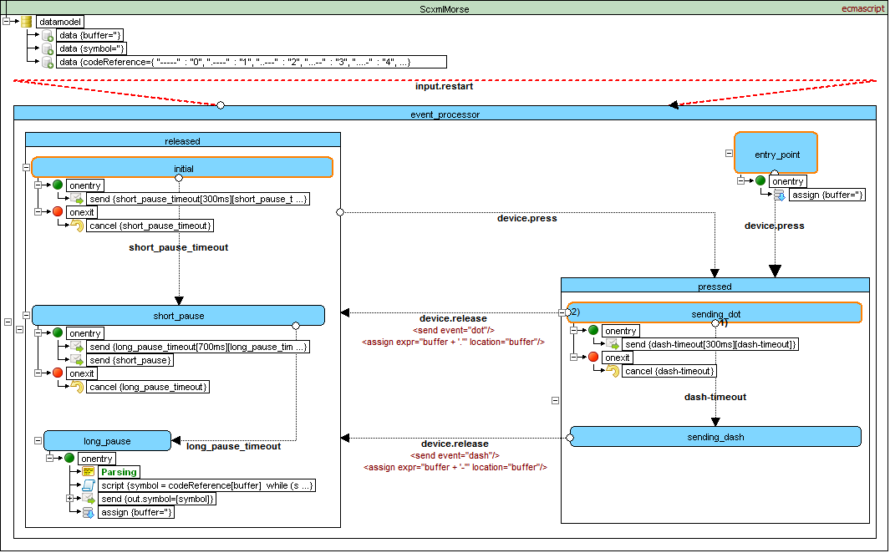

# Qt SCXML Morse Code Trainer
This example demonstrates different techniques of using SCXML data models in applications

## Table of contents

### 1. Pure NULL datamodel

**Proc:**
- program logic is completely written in SCXML with NULL datamodel without any dependencies
- may be run on all SCXML platforms

**Cons:**
- encoding logic is too difficult for designing

### 2. Null datamodel with parser written on application side

**Consists of 2 parts:**
- event processor (written in SCXML with NULL datamodel)
- encoder (written in C++)

**Proc:**
- state chart is tiny
- encoding logic is easy to design in C++

**Cons:**
- not portable to other languages except C++

### 3. EcmaScript datamodel

**Proc:**
- program logic is completely written in SCXML with EcmaScript datamodel
- state chart is tiny

**Cons:**
- not all SCXML platforms support EcmaScript
