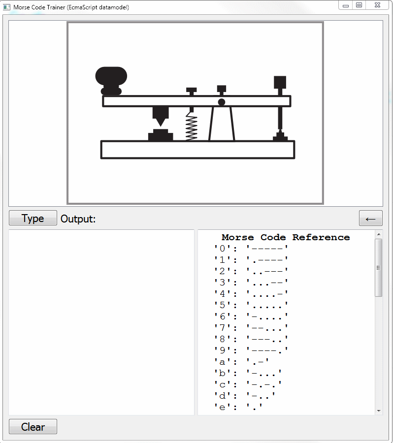
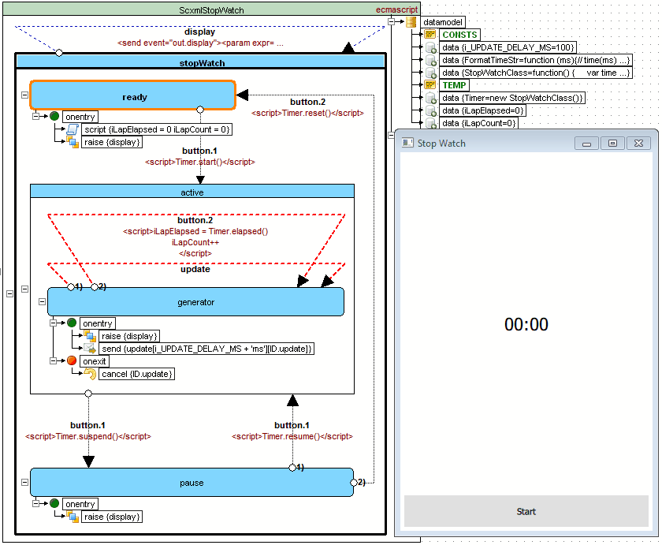

 | [Contents](#table-of-contents) | [Overview](../../../README.md#scxml-overview) | [Editor](https://alexzhornyak.github.io/ScxmlEditor-Tutorial/) | [Forum](https://github.com/alexzhornyak/SCXML-tutorial/discussions) |
|---|---|---|---|

# Qt SCXML Examples

## Table of contents
- **[Infotainment Radio Bolero Simulator (Qt QML SCXML EcmaScript)](SkodaBoleroInfotainment)**
- [Morse Code Trainer (Qt Widgets SCXML Null EcmaScript)](Morse)
- [Salus RT500 Simulator (Qt Widgets SCXML CPlusPlus)](https://github.com/alexzhornyak/Salus-RT500-Simulator)
- [StopWatch (Qt QML SCXML EcmaScript)](StopWatch)
- **[Qt SCXML Standard Compliance Tester (EcmaScript)](TesterW3C)**
- [KT76C Transponder Simulator (Qt USCXMLCLib Lua)](https://github.com/alexzhornyak/UscxmlCLib/tree/master/Examples/Qt/KT76CSim)
- [Tester W3C (Qt USCXMLCLib Lua)](https://github.com/alexzhornyak/UscxmlCLib/tree/master/Examples/Qt/TesterW3C)

## [Infotainment Radio Bolero Simulator (Qt QML SCXML EcmaScript)](SkodaBoleroInfotainment)
This project is intended to test Qt QML SCXML module for designing in-vehicle infotainment systems

## [Morse Code Trainer (Qt Widgets SCXML Null EcmaScript)](Morse)
This example demonstrates different techniques of using SCXML data models in applications

## [Salus RT500 Simulator (Qt Widgets SCXML CPlusPlus)](https://github.com/alexzhornyak/Salus-RT500-Simulator)
**Salus RT500 (Digital Room Thermostat) Simulator** is a widget-based application that demonstrates usage of **Qt SCXML CPP DataModel**

## [StopWatch (Qt QML SCXML EcmaScript)](StopWatch)
Classical StopWatch with 2 buttons. All internal logic is written with SCXML EcmaScript Datamodel

## [Qt SCXML Standard Compliance Tester](TesterW3C)
Qt widget-based application that executes [W3C SCXML tests](https://www.w3.org/Voice/2013/scxml-irp/) and custom tests for EcmaScript datamodel in sequence, and is able to build a report in Markdown format

## [KT76C Transponder Simulator (Qt USCXMLCLib Lua)](https://github.com/alexzhornyak/UscxmlCLib/tree/master/Examples/Qt/KT76CSim)
The BendixKing KT 76C transponder - radio transmitter/receiver which operates on radar frequencies

## [Tester W3C (Qt USCXMLCLib Lua)](https://github.com/alexzhornyak/UscxmlCLib/tree/master/Examples/Qt/TesterW3C)
Qt widget-based application that executes [W3C SCXML tests](https://www.w3.org/Voice/2013/scxml-irp/) for Lua Datamodel in sequence

| [TOP](#top-anchor) | [Contents](#table-of-contents) | [Overview](../../../README.md#scxml-overview) | [Editor](https://alexzhornyak.github.io/ScxmlEditor-Tutorial/) | [Forum](https://github.com/alexzhornyak/SCXML-tutorial/discussions) |
|---|---|---|---|---|
