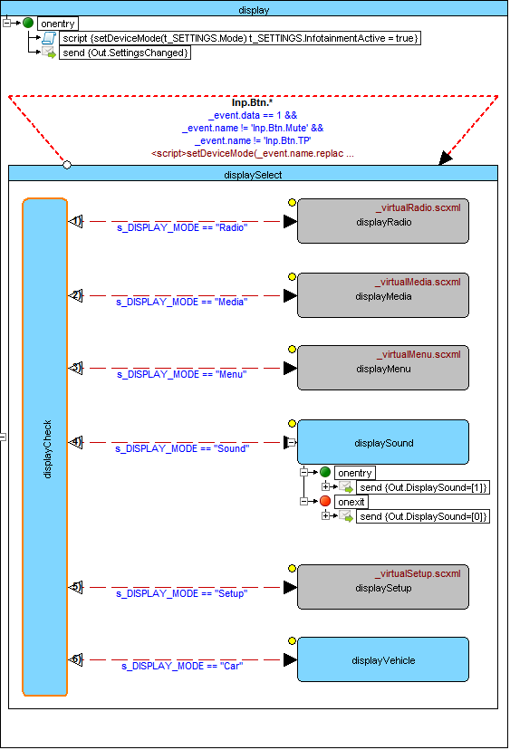

<a name="top-anchor"/>

| [Contents](../../../README.md#table-of-contents) | [Overview](../../../README.md#scxml-overview) | [Examples](../../README.md) | [Editor](https://alexzhornyak.github.io/ScxmlEditor-Tutorial/) | [Forum](https://github.com/alexzhornyak/SCXML-tutorial/discussions) |
|---|---|---|---|---|

# Qt QML SCXML Infotainment Radio Bolero Simulator
This project is intended to test Qt QML SCXML module for designing in-vehicle infotainment systems 

- [Video description (General)](https://youtu.be/Er-G4Ii6bhs)
- [Video description (MediaPlayer)](https://youtu.be/PSV9UL7_nRQ)

# Description and rules
User interface is separated from internal logic. QML controls do not interact between each other directly. Internal application logic is defined in SCXML file with ECMAScript data model that is compiled into a C++ class. The info about hitting any GUI controls is passed to the state machine that connects their communication interfaces together. Application settings data is based on JSON object which is integrated as [\<data\>](../../../Doc/datamodel.md) element of state machine datamodel

# SCXML model
SCXML model is organized as [SCXMLEditor](https://alexzhornyak.github.io/ScxmlEditor-Tutorial/) project [Model/projectBolero.sproj](https://raw.githubusercontent.com/alexzhornyak/SCXML-tutorial/master/Examples/Qt/SkodaBoleroInfotainment/Model/projectBolero.sproj).

# Media
## Inputs
- CD slot

- SD card slot

- USB
- AUX

It is possible to assign drive source via settings

## Check inputs

## Select input

## MediaPlayer

| [TOP](#top-anchor) | [Contents](../../../README.md#table-of-contents) | [Overview](../../../README.md#scxml-overview) | [Examples](../../README.md) | [Editor](https://alexzhornyak.github.io/ScxmlEditor-Tutorial/) | [Forum](https://github.com/alexzhornyak/SCXML-tutorial/discussions) |
|---|---|---|---|---|---|
