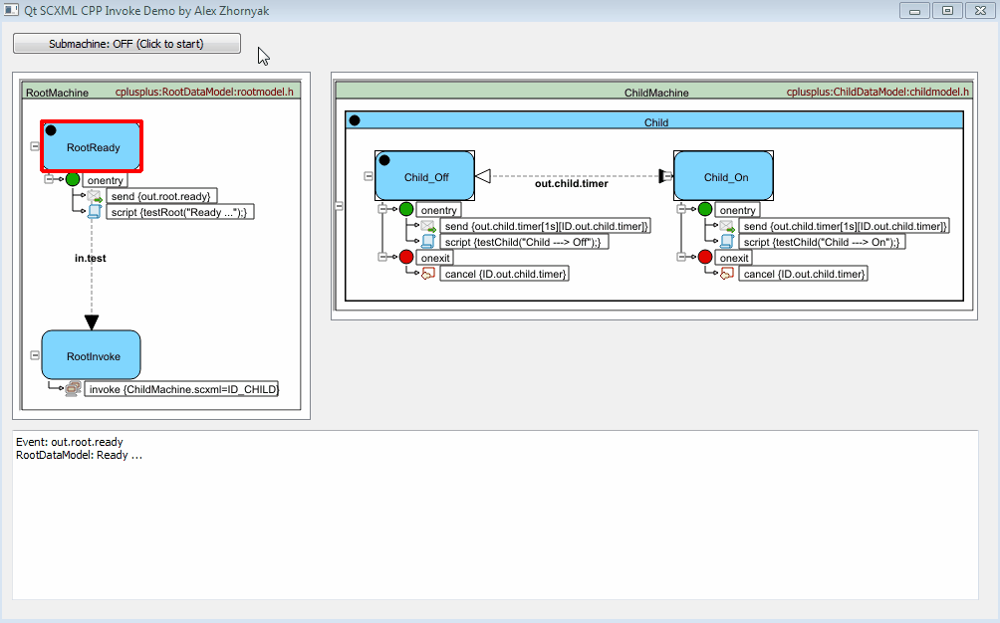

# Qt SCXML CPP Invoke Demo
Qt widget-based application that demonstrates how to invoke child state machines with **QScxmlCppDataModel**.

It will be shown how to:
* set datamodel for child state machine
* pass data to parent and child datamodel
* monitor parent and child state machines

