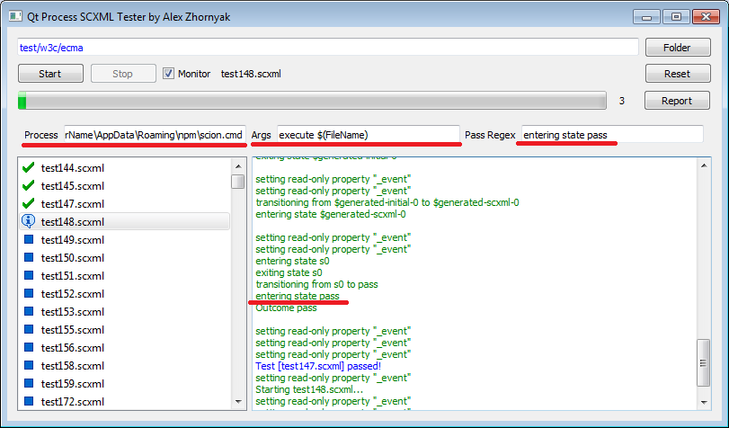
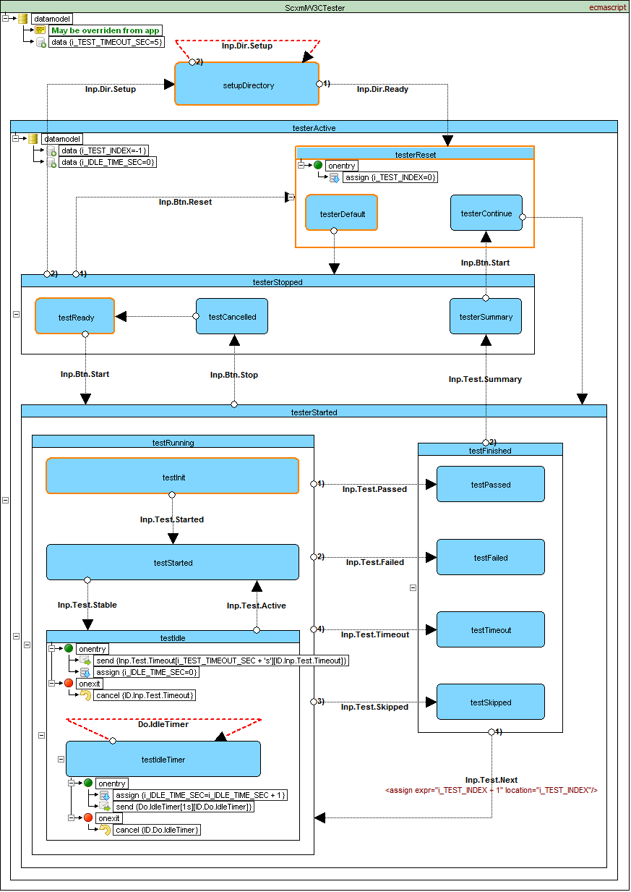
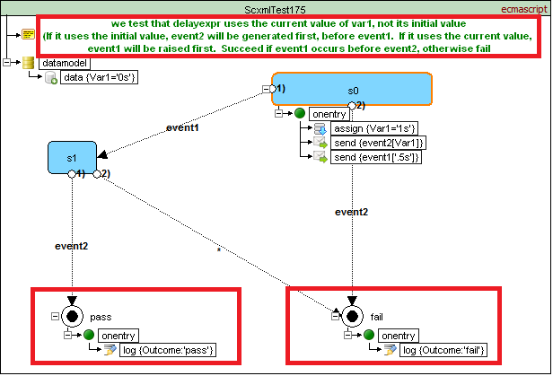
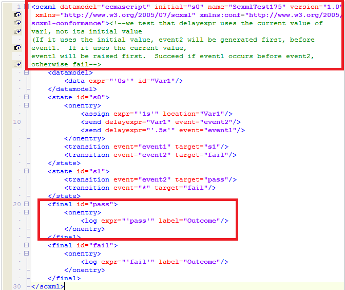
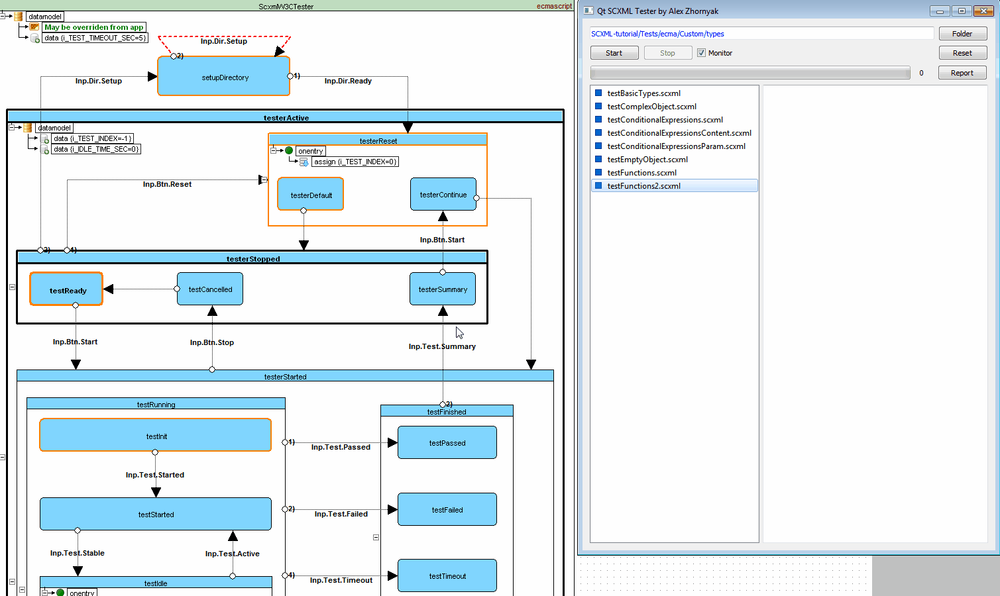

<a name="top-anchor"/>

| [Contents](../../../README.md#table-of-contents) | [Overview](../../../README.md#scxml-overview) | [Examples](../../README.md) | [Editor](https://alexzhornyak.github.io/ScxmlEditor-Tutorial/) | [Forum](https://github.com/alexzhornyak/SCXML-tutorial/discussions) |
|---|---|---|---|---|

# List of projects
- SCXML Standard Compliance Tester for external applications **(TesterProcessW3C.pro)**
- Qt SCXML Standard Compliance Tester **(TesterW3C.pro)**

# [SCXML Standard Compliance Tester for external applications](../../../Tests/README.md)
**TesterProcessW3C** - Qt widget-based application that is a wrapper for external applications that can execute [W3C SCXML tests](https://www.w3.org/Voice/2013/scxml-irp/)

# [Qt SCXML Standard Compliance Tester](../../../Tests/README.md)
**TesterW3C** - Qt widget-based application that executes [W3C SCXML tests](https://www.w3.org/Voice/2013/scxml-irp/) and custom tests in sequence using [Qt SCXML Framework](https://doc.qt.io/qt-5/qtscxml-index.html), and is able to [build a report in Markdown format](../../../Tests/ecma/W3C/Mandatory/Auto/report__QtScxml_5_15_0___msvc2015_64bit__Win7_1.md)

# Rules for writing automated Qt SCXML tests

## 1. Test description
Test **MUST have commented description** as the first comment in XML document or the first comment of XML root [\<scxml\>](../../../Doc/scxml.md) element
> WARNING! Text in comment must be a **valid Markdown text**!

## 2. Top-level [\<final\>](../../../Doc/final.md) state with id 'pass'
Look at the picture above

## 3. Top-level [\<final\>](../../../Doc/final.md) state with id 'fail'
Look at the picture above

## 4. Restriction for stable configuration
We use 5 seconds timeout per stable configuration of the state machine. It means that if your state machine does nothing per 5 seconds it will be marked as failed by timeout.

## 5. Syntax errors and critical SCXML bugs
We validate only tests without XML syntax errors and critical SCXML bugs such as transition deadlock (when two states are connected with empty transitions) etc.
You may previously use either [ScxmlEditor](https://alexzhornyak.github.io/ScxmlEditor-Tutorial/) which may detect it on the stage of test designing or [uSCXML browser](https://github.com/tklab-tud/uscxml).  
See https://stackoverflow.com/questions/31694832/how-do-i-verify-that-my-scxml-defines-a-valid-state-machine

# Demo

| [TOP](#top-anchor) | [Contents](../../../README.md#table-of-contents) | [Overview](../../../README.md#scxml-overview) | [Examples](../../README.md) | [Editor](https://alexzhornyak.github.io/ScxmlEditor-Tutorial/) | [Forum](https://github.com/alexzhornyak/SCXML-tutorial/discussions) |
|---|---|---|---|---|---|
