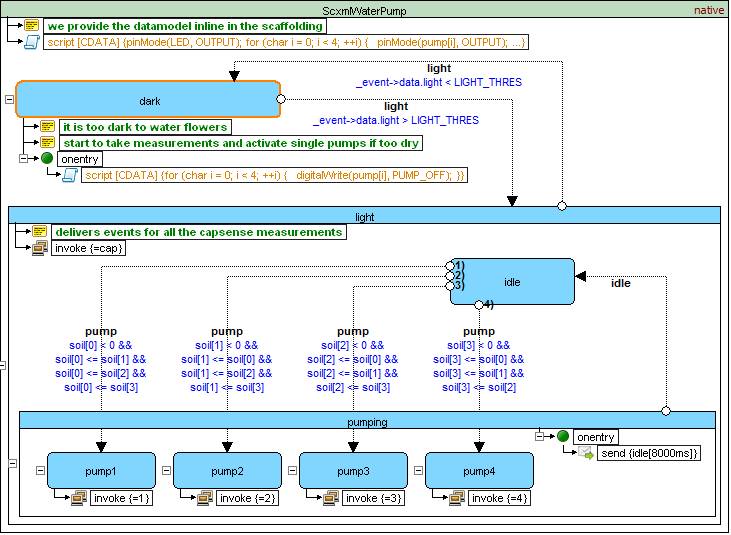

# SCXML Examples
## W3C Examples
- [SCXML language overview](#language-overview)
- [Microwave example](#microwave-example)
- [Microwave Example (Using parallel)](#microwave-example-using-parallel)
- [Calculator Example](#calculator-example)

## Qt SCXML Examples
- **[Infotainment Radio Bolero Simulator (Qt QML SCXML EcmaScript)](Qt/SkodaBoleroInfotainment)**
- [Morse Code Trainer (Qt Widgets SCXML Null EcmaScript)](Qt/Morse)
- [Salus RT500 Simulator (Qt Widgets SCXML CPlusPlus)](https://github.com/alexzhornyak/Salus-RT500-Simulator)
- [StopWatch (Qt QML SCXML EcmaScript)](Qt/StopWatch)
- **[Qt SCXML Standard Compliance Tester](Qt/TesterW3C)**
- [KT76C Transponder Simulator (Qt USCXMLCLib Lua)](https://github.com/alexzhornyak/UscxmlCLib/tree/master/Examples/Qt/KT76CSim)
- [Tester W3C (Qt USCXMLCLib Lua)](https://github.com/alexzhornyak/UscxmlCLib/tree/master/Examples/Qt/TesterW3C)

## uSCXML Examples
- [SCXML on an ATMega328](http://tklab-tud.github.io/uscxml/embedded.html)

# Preview
## [W3C Examples](https://www.w3.org/TR/scxml/#Examples)
### [Language Overview](https://www.w3.org/TR/scxml/#N11608)
This SCXML document gives an overview of the SCXML language and shows the use of its state machine transition flows


### [Microwave Example](https://www.w3.org/TR/scxml/#N11619)
The example below shows the implementation of a simple microwave oven using SCXML


### [Microwave Example (Using parallel)](https://www.w3.org/TR/scxml/#MicrowaveParallel)
The example below shows the implementation of a simple microwave oven using **\<parallel\>** and the SCXML **'In()' predicate**


### [Calculator Example](https://www.w3.org/TR/scxml/#N11630)
The example below shows the implementation of a simple calculator in SCXML


## Qt SCXML Examples
### [Infotainment Radio Bolero Simulator (Qt QML SCXML EcmaScript)](https://github.com/alexzhornyak/SCXML-tutorial/tree/master/Examples/Qt/SkodaBoleroInfotainment)
This project is intended to test Qt QML SCXML module for designing in-vehicle infotainment systems


### [Morse Code Trainer (Qt Widgets SCXML Null EcmaScript)](https://github.com/alexzhornyak/SCXML-tutorial/tree/master/Examples/Qt/Morse)
This example demonstrates different techniques of using SCXML data models in applications


### [Salus RT500 Simulator (Qt Widgets SCXML CPlusPlus)](https://github.com/alexzhornyak/Salus-RT500-Simulator)
**Salus RT500 (Digital Room Thermostat) Simulator** is a widget-based application that demonstrates usage of **Qt SCXML CPP DataModel**


### [StopWatch (Qt QML SCXML EcmaScript)](https://github.com/alexzhornyak/SCXML-tutorial/tree/master/Examples/Qt/StopWatch)
Classical StopWatch with 2 buttons. All internal logic is written with SCXML EcmaScript Datamodel


### [Qt SCXML Standard Compliance Tester](Qt/TesterW3C)
Qt widget-based application that executes [W3C SCXML tests](https://www.w3.org/Voice/2013/scxml-irp/) and custom tests in sequence, and is able to build a report in Markdown format


### [KT76C Transponder Simulator (Qt USCXMLCLib Lua)](https://github.com/alexzhornyak/UscxmlCLib/tree/master/Examples/Qt/KT76CSim)
The BendixKing KT 76C transponder - radio transmitter/receiver which operates on radar frequencies


### [Tester W3C (Qt USCXMLCLib Lua)](https://github.com/alexzhornyak/UscxmlCLib/tree/master/Examples/Qt/TesterW3C)
Qt widget-based application that executes [W3C SCXML tests](https://www.w3.org/Voice/2013/scxml-irp/) for Lua Datamodel in sequence


## uSCXML Examples
### [SCXML on an ATMega328](http://tklab-tud.github.io/uscxml/embedded.html)


<details><summary><b>Source code</b></summary>
<p>
  
```xml
<scxml datamodel="native" initial="dark" name="ScxmlWaterPump" version="1.0" xmlns="http://www.w3.org/2005/07/scxml"><!--we provide the datamodel inline in the scaffolding-->
	<script><![CDATA[pinMode(LED, OUTPUT);
for (char i = 0; i < 4; ++i) {
  pinMode(pump[i], OUTPUT);
  digitalWrite(pump[i], PUMP_OFF);
  bed[i].set_CS_AutocaL_Millis(0xFFFFFFFF);
}]]>
	</script>
	<state id="dark"><!--it is too dark to water flowers--><!--start to take measurements and activate single pumps if too dry-->
		<onentry>
			<script><![CDATA[for (char i = 0; i < 4; ++i) {
  digitalWrite(pump[i], PUMP_OFF);
}]]>
			</script>
		</onentry>
		<transition cond="_event-&gt;data.light &gt; LIGHT_THRES" event="light" target="light"/>
	</state>
	<state id="light"><!--delivers events for all the capsense measurements-->
		<invoke id="cap" type="capsense"/>
		<transition cond="_event-&gt;data.light &lt; LIGHT_THRES" event="light" target="dark"/>
		<state id="idle">
			<transition cond="soil[0] &lt; 0 &amp;&amp;
soil[0] &lt;= soil[1] &amp;&amp;
soil[0] &lt;= soil[2] &amp;&amp;
soil[0] &lt;= soil[3]" event="pump" target="pump1"/>
			<transition cond="soil[1] &lt; 0 &amp;&amp;
soil[1] &lt;= soil[0] &amp;&amp;
soil[1] &lt;= soil[2] &amp;&amp;
soil[1] &lt;= soil[3]" event="pump" target="pump2"/>
			<transition cond="soil[2] &lt; 0 &amp;&amp;
soil[2] &lt;= soil[0] &amp;&amp;
soil[2] &lt;= soil[1] &amp;&amp;
soil[2] &lt;= soil[3]" event="pump" target="pump3"/>
			<transition cond="soil[3] &lt; 0 &amp;&amp;
soil[3] &lt;= soil[0] &amp;&amp;
soil[3] &lt;= soil[1] &amp;&amp;
soil[3] &lt;= soil[2]" event="pump" target="pump4"/>
		</state>
		<state id="pumping">
			<onentry>
				<send delay="8000ms" event="idle"/>
			</onentry>
			<transition event="idle" target="idle"/>
			<state id="pump1">
				<invoke id="1" type="pump"/>
			</state>
			<state id="pump2">
				<invoke id="2" type="pump"/>
			</state>
			<state id="pump3">
				<invoke id="3" type="pump"/>
			</state>
			<state id="pump4">
				<invoke id="4" type="pump"/>
			</state>
		</state>
	</state>
</scxml>
```

</p></details>

| [TOP](#scxml-examples) | [SCXML Wiki](../README.md) | [Forum](https://github.com/alexzhornyak/SCXML-tutorial/discussions) |
|---|---|---|
