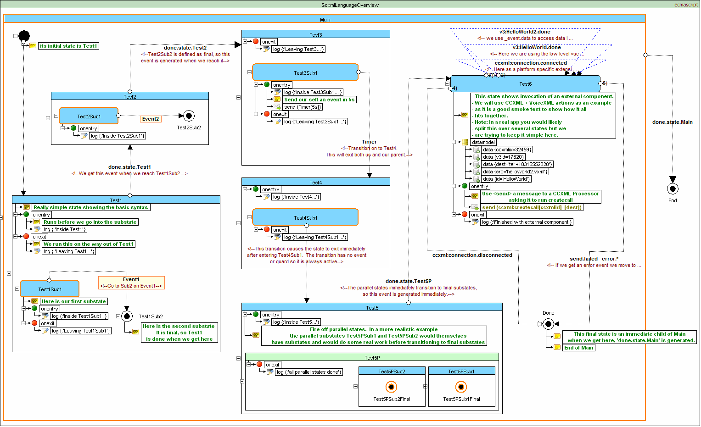

# SCXML Examples
## W3C Examples
- [SCXML language overview](#language-overview)
- [Microwave example](#microwave-example)
- [Microwave Example (Using parallel)](#microwave-example-using-parallel)
- [Calculator Example](#calculator-example)

## Qt SCXML Examples
- [Infotainment Radio Bolero Simulator (Qt QML SCXML EcmaScript)](https://github.com/alexzhornyak/SCXML-tutorial/tree/master/Examples/Qt/SkodaBoleroInfotainment)
- [Morse Code Trainer (Qt Widgets SCXML Null EcmaScript)](https://github.com/alexzhornyak/SCXML-tutorial/tree/master/Examples/Qt/Morse)
- [Salus RT500 Simulator (Qt Widgets SCXML CPlusPlus)](https://github.com/alexzhornyak/Salus-RT500-Simulator)
- [StopWatch (Qt QML SCXML EcmaScript)](https://github.com/alexzhornyak/SCXML-tutorial/tree/master/Examples/Qt/StopWatch)
- [KT76C Transponder Simulator (Qt USCXMLCLib Lua)](https://github.com/alexzhornyak/UscxmlCLib/tree/master/Examples/Qt/KT76CSim)
- [Tester W3C (Qt USCXMLCLib Lua)](https://github.com/alexzhornyak/UscxmlCLib/tree/master/Examples/Qt/TesterW3C)

# Preview
## [W3C Examples](https://www.w3.org/TR/scxml/#Examples)
### [Language Overview](https://www.w3.org/TR/scxml/#N11608)
This SCXML document gives an overview of the SCXML language and shows the use of its state machine transition flows

### [Microwave Example](https://www.w3.org/TR/scxml/#N11619)
The example below shows the implementation of a simple microwave oven using SCXML

### [Microwave Example (Using parallel)](https://www.w3.org/TR/scxml/#MicrowaveParallel)
The example below shows the implementation of a simple microwave oven using **\<parallel\>** and the SCXML **'In()' predicate**

### [Calculator Example](https://www.w3.org/TR/scxml/#N11630)
The example below shows the implementation of a simple calculator in SCXML

## Qt SCXML Examples
### [Infotainment Radio Bolero Simulator (Qt QML SCXML EcmaScript)](https://github.com/alexzhornyak/SCXML-tutorial/tree/master/Examples/Qt/SkodaBoleroInfotainment)
This project is intended to test Qt QML SCXML module for designing in-vehicle infotainment systems

### [Morse Code Trainer (Qt Widgets SCXML Null EcmaScript)](https://github.com/alexzhornyak/SCXML-tutorial/tree/master/Examples/Qt/Morse)
This example demonstrates different techniques of using SCXML data models in applications

### [Salus RT500 Simulator (Qt Widgets SCXML CPlusPlus)](https://github.com/alexzhornyak/Salus-RT500-Simulator)
**Salus RT500 (Digital Room Thermostat) Simulator** is a widget-based application that demonstrates usage of **Qt SCXML CPP DataModel**

### [StopWatch (Qt QML SCXML EcmaScript)](https://github.com/alexzhornyak/SCXML-tutorial/tree/master/Examples/Qt/StopWatch)
Classical StopWatch with 2 buttons. All internal logic is written with SCXML EcmaScript Datamodel

### [KT76C Transponder Simulator (Qt USCXMLCLib Lua)](https://github.com/alexzhornyak/UscxmlCLib/tree/master/Examples/Qt/KT76CSim)
The BendixKing KT 76C transponder - radio transmitter/receiver which operates on radar frequencies

### [Tester W3C (Qt USCXMLCLib Lua)](https://github.com/alexzhornyak/UscxmlCLib/tree/master/Examples/Qt/TesterW3C)
Qt widget-based application that executes [W3C SCXML tests](https://www.w3.org/Voice/2013/scxml-irp/) for Lua Datamodel in sequence

| [TOP](#scxml-examples) | [SCXML Wiki](../README.md) | [Forum](https://github.com/alexzhornyak/SCXML-tutorial/discussions) |
