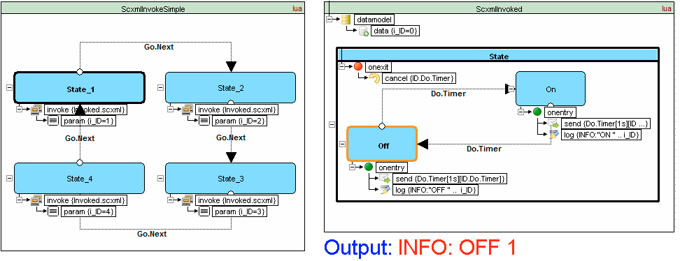
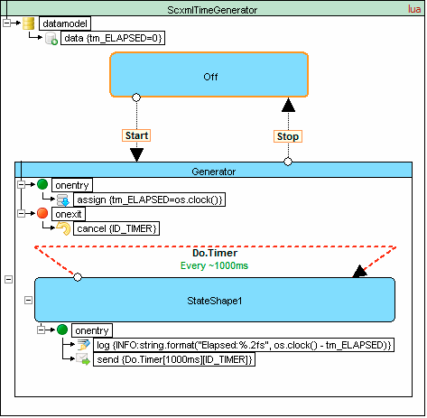
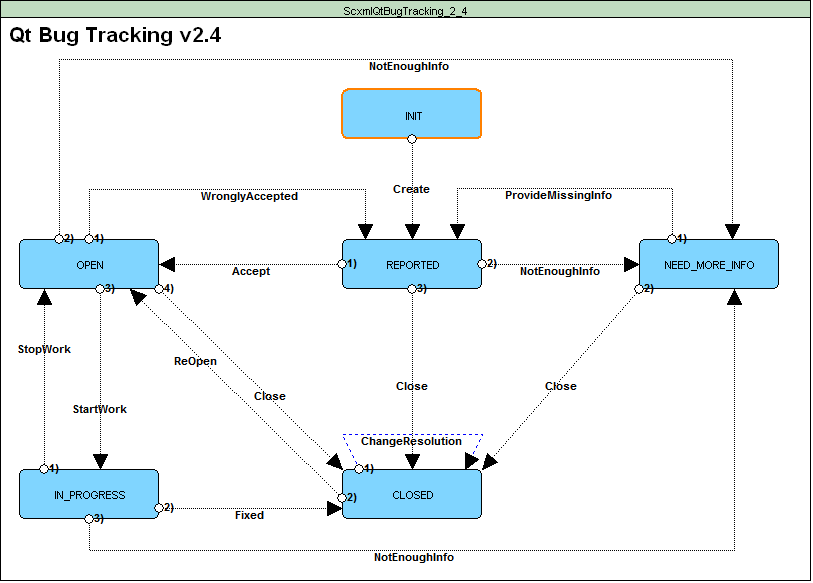
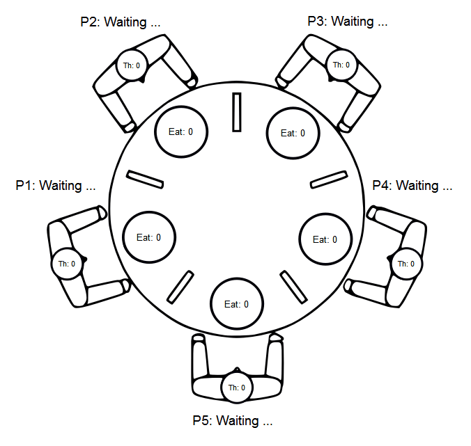
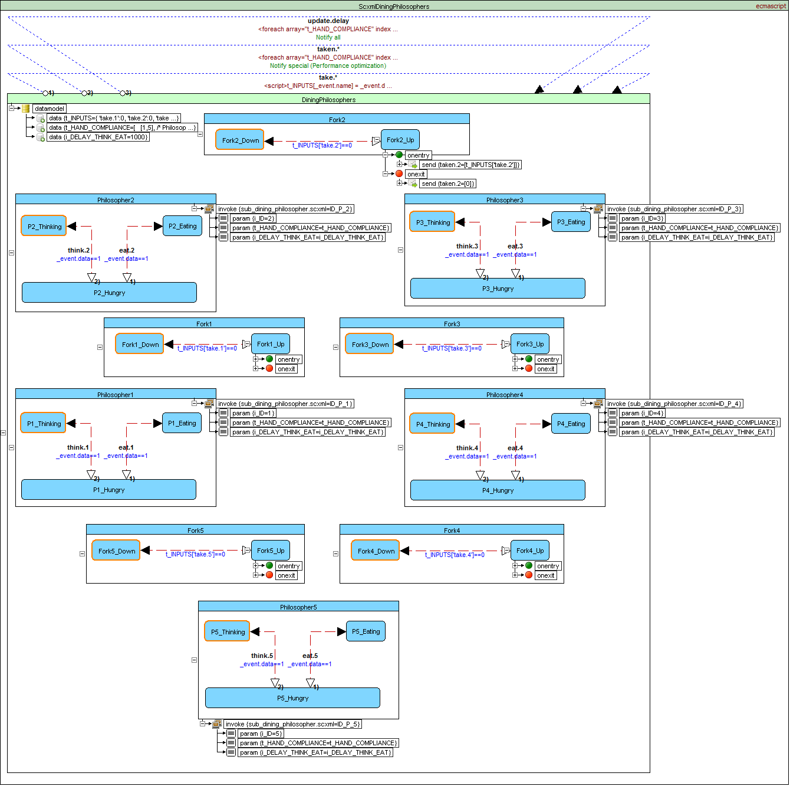
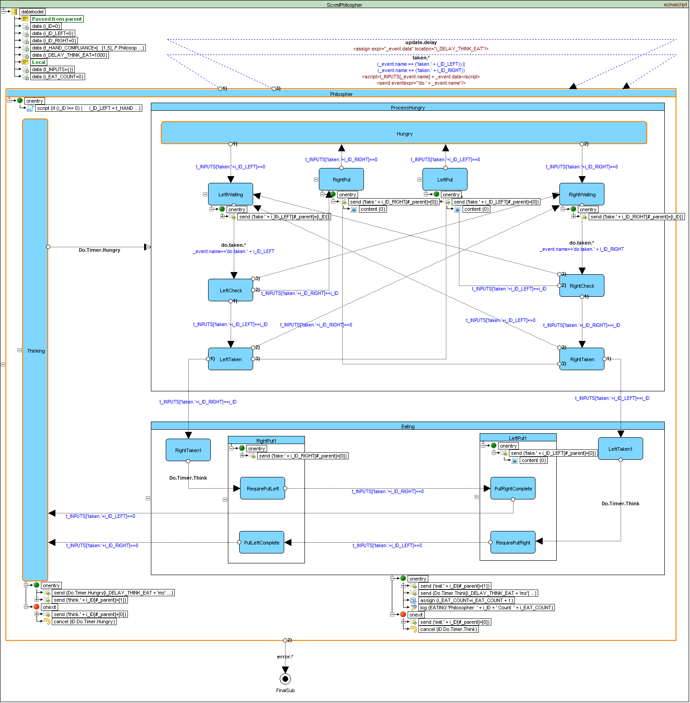

<a name="top-anchor"/>

| [Contents](#table-of-contents) | [Overview](#scxml-overview) | [Examples](Examples/README.md) | [Editor](https://alexzhornyak.github.io/ScxmlEditor-Tutorial/) | [Forum](https://github.com/alexzhornyak/SCXML-tutorial/discussions) | 
|---|---|---|---|---|


# SCXML Tutorial

This project is an attempt to illustrate the current [SCXML standard](https://www.w3.org/TR/scxml)

**New!** [Video version of the tutorial](https://youtu.be/5ebxa-nIpiE?list=PLUbY_L_9E-b_YuK-IWjUWYxcpcKccSX1N)

## Hello world


```xml
<scxml name="Scxml" version="1.0" xmlns="http://www.w3.org/2005/07/scxml">
	<final id="Final">
		<onentry>
			<log expr="Hello, world!" label="INFO"/>
		</onentry>
	</final>
</scxml>
```

## Questions & Answers
[](https://discord.gg/5XWDsbEXzn)

## Table of contents
* **Core Constructs**
	- [\<scxml\>](Doc/scxml.md)
	- [\<state\>](Doc/state.md)
	- [\<parallel\>](Doc/parallel.md)	
	- [\<initial\>](Doc/Introduction.md#initial-state)
	- [\<final\>](Doc/final.md)	
	- [\<transition\>](Doc/transition.md)
	- [\<onentry\>](Doc/onentry.md)
	- [\<onexit\>](Doc/onexit.md)
	- [\<history\>](Doc/history.md)
* **Executable Content**
	- [\<raise\>](Doc/raise.md)
	- [\<if\>](Doc/if_else_elseif.md#if)
	- [\<else\>](Doc/if_else_elseif.md#else)
	- [\<elseif\>](Doc/if_else_elseif.md#elseif)
	- [\<foreach\>](Doc/foreach.md)
	- [\<log\>](Doc/log.md)
* **Data Model and Data Manipulation**
	- [\<datamodel\>](Doc/datamodel.md)
	- [\<data\>](Doc/datamodel.md#data)
	- [\<assign\>](Doc/assign.md)
	- [\<donedata\>](Doc/donedata.md)
	- [\<content\>](Doc/content.md)
	- [\<param\>](Doc/param.md)
	- [\<script\>](Doc/script.md)
* **External Communications**
	- [\<send\>](Doc/send.md)
	- [\<cancel\>](Doc/cancel.md)
	- [\<invoke\>](Doc/invoke.md)
	- [\<finalize\>](Doc/finalize.md)
	- [Basic HTTP Event I/O Processor](Doc/BasicHTTPEventIO.md)

## [SCXML Frameworks W3C Standard Specification Compliance](Tests/README.md)

| Framework | Datamodel | W3C Mandatory | W3C Optional | Compliance |
|---|---|---|---|---|
| **[uSCXML 2.0](https://github.com/tklab-tud/uscxml)** | **ecmascript** | **[159 of 159](Tests/ecma/W3C/Mandatory/Auto/report__USCXML_2_0_0___msvc2015_32bit__Win7_1.md)** | **[33 of 33](Tests/ecma/W3C/Optional/Auto/report__USCXML_2_0_0___msvc2015_32bit__Win7_1.md)** | **Full** |
| [Qt SCXML 5.15](https://doc.qt.io/qt-5/qtscxml-index.html) | ecmascript | [141 of 159](Tests/ecma/W3C/Mandatory/Auto/report__QtScxml_5_15_0___msvc2015_64bit__Win7_1.md) | [17 of 33](Tests/ecma/W3C/Optional/Auto/report__QtScxml_5_15_0___msvc2015_64bit__Win7_1.md) | Partial |
| [SCION CLI 1.0.37](https://gitlab.com/scion-scxml/cli) | ecmascript | [156 of 159](Tests/ecma/W3C/Mandatory/Auto/report__SCION_CLI__1_0_37__Win7_1.md) | [18 of 33](Tests/ecma/W3C/Optional/Auto/report__SCION_CLI__1_0_37__Win7_1.md) | Partial |
| [PyBlendSCXML 1.0.0](https://github.com/alexzhornyak/PyBlendSCXML) | python | [159 of 159](Tests/python/W3C/Mandatory/Auto/report_PyBlendSCXML_1_0__Blender_4_1__Win10.md) | [22 of 33](Tests/python/W3C/Optional/Auto/report_PyBlendSCXML_1_0__Blender_4_1__Win10.md) | Partial |

## [Examples](Examples/README.md)
[1. Microwave owen](Doc/microwave_example.md)

[2. Microwave owen (using parallel)](Doc/microwave_parallel.md)

[3. Calculator](Doc/calculator.md)

[4. Salus RT500 (Digital Room Thermostat) Simulator](https://github.com/alexzhornyak/Salus-RT500-Simulator)

[5. Morse Code Trainer](https://github.com/alexzhornyak/SCXML-tutorial/tree/master/Examples/Qt/Morse)

[6. StopWatch](https://github.com/alexzhornyak/SCXML-tutorial/tree/master/Examples/Qt/StopWatch)

[7. Infotainment Radio Bolero Simulator](https://github.com/alexzhornyak/SCXML-tutorial/tree/master/Examples/Qt/SkodaBoleroInfotainment)
[](https://github.com/alexzhornyak/SCXML-tutorial/tree/master/Examples/Qt/SkodaBoleroInfotainment)

### [Qt SCXML Examples](Examples/Qt/README.md)

### Articles
[1. Inheritance (Visual) in SCXML (State Machines)](Doc/Inheritance_SCXML.md)

## [W3C Examples](Doc/W3C.md#w3c-examples)
## [W3C IRP tests](Doc/W3C.md#w3c-irp-tests)

## Donations
When we started the project in 2016 there were no SCXML illustrations, no simple explanation of SCXML details, no good examples. We felt the power of SCXML but understood that without [simple explanations](#scxml-overview), [illustrative examples](Examples/README.md) and [convinient modelling tools](https://github.com/alexzhornyak/ScxmlEditor-Tutorial) it's worth nothing.

If you are interested in the development of SCXML tutorials and examples we would be highly appreciated for any help.

| Paypal |
| ------ |
| [](https://www.paypal.com/donate/?hosted_button_id=6W4NBU7TEF27W) |

# SCXML Overview

## Basic State Machine Notation

The most basic state machine concepts are [**\<state\>**](Doc/state.md), [**\<transition\>**](Doc/transition.md) and **event**. Each state contains a set of transitions that define how it reacts to events. Events can be generated by the state machine itself or by external entities. In a traditional state machine, the machine is always in a single state. This state is called the active state. When an event occurs, the state machine checks the transitions that are defined in the active state. If it finds one that matches the event, it moves from the active state to the state specified by the transition (called the "target" of the transition.) Thus the target state becomes the new active state.


```xml
<scxml initial="Start" name="Scxml" version="1.0" xmlns="http://www.w3.org/2005/07/scxml">
	<final id="Final">
		<onentry>
			<log expr="Finished!" label="INFO"/>
		</onentry>
	</final>
	<state id="Start">
		<transition event="Event" target="Final"/>
	</state>
</scxml>
```


## [Atomic state](Doc/state.md#atomic-state)

Does not contain any child [states](Doc/state.md)


```xml
<scxml name="Scxml" version="1.0" xmlns="http://www.w3.org/2005/07/scxml">
	<state id="Level 1"/>
</scxml>
```


## [Compound states](Doc/state.md#compound-state)

May contain nested [\<state\>](Doc/state.md) elements and the nesting may proceed to any depth
	

```xml
<scxml name="Scxml" version="1.0" xmlns="http://www.w3.org/2005/07/scxml">
	<state id="Level 1">
		<state id="Level 2">
			<state id="Level 3"/>
		</state>
	</state>
</scxml>
```


## [Parallel states](Doc/parallel.md)

The [\<parallel\>](Doc/parallel.md) element represents a state whose children are executed in parallel.


```xml
<scxml name="Scxml" version="1.0" xmlns="http://www.w3.org/2005/07/scxml">
	<parallel id="Airplane_Engines">
		<state id="Engine_1" initial="Engine_1_Off">
			<state id="Engine_1_Off">
				<transition event="Start.1" target="Engine_1_On"/>
			</state>
			<state id="Engine_1_On">
				<transition event="Shutdown.1" target="Engine_1_Off"/>
			</state>
		</state>
		<state id="Engine_2" initial="Engine_2_Off">
			<state id="Engine_2_Off">
				<transition event="Start.2" target="Engine_2_On"/>
			</state>
			<state id="Engine_2_On">
				<transition event="Shutdown.2" target="Engine_2_Off"/>
			</state>
		</state>
	</parallel>
</scxml>
```

## Initial state

Represents the default initial state for a complex [\<state\>](Doc/state.md) element


```xml
<scxml name="Scxml" version="1.0" xmlns="http://www.w3.org/2005/07/scxml">
	<state id="Work">
		<initial>
			<transition target="Ready"/>
		</initial>
		<state id="Ready"/>
	</state>
</scxml>
```

## [Final state](Doc/final.md)

Represents a final state of an [\<scxml\>](Doc/scxml.md) or compound [\<state\>](Doc/state.md) element.


```xml
<scxml name="Scxml" version="1.0" xmlns="http://www.w3.org/2005/07/scxml">
	<state id="Work">
		<transition event="done.state.Work" target="WorkFinished"/>
		<state id="CompletingTask">
			<transition target="Completed"/>
		</state>
		<final id="Completed"/>
	</state>
	<final id="WorkFinished"/>
</scxml>
```

## [History state](Doc/history.md)

The [\<history\>](Doc/history.md) pseudo-state allows a state machine to remember its state configuration. A [\<transition\>](Doc/transition.md) taking the [\<history\>](Doc/history.md) state as its target will return the state machine to this recorded configuration.


```xml
<scxml name="Scxml" version="1.0" xmlns="http://www.w3.org/2005/07/scxml">
	<state id="Work">
		<transition event="Pause" target="Expecting"/>
		<state id="Off">
			<transition event="Switch" target="On"/>
		</state>
		<state id="On">
			<transition event="Switch" target="Off"/>
		</state>
		<initial>
			<transition target="HistoryPoint"/>
		</initial>
		<history id="HistoryPoint">
			<transition target="Off"/>
		</history>
	</state>
	<state id="Expecting">
		<transition event="Resume" target="HistoryPoint"/>
	</state>
</scxml>
```

## [Transitions](Doc/transition.md)
Transitions between states are triggered by events and conditionalized via guard conditions. They may contain executable content, which is executed when the transition is taken.


```xml
<scxml datamodel="lua" name="Scxml" version="1.0" xmlns="http://www.w3.org/2005/07/scxml">
	<state id="Work" initial="Off">
		<transition event="Update" type="internal">
			<log expr="'Updated'" label="OnUpdate"/>
		</transition>
		<transition event="ReInit" target="Work" type="internal"/>
		<transition event="Quit" target="End"/>
		<transition event="error.*" target="Fail"/>
		<state id="Off">
			<transition cond="_event.data==1" event="Switch" target="On"/>
		</state>
		<state id="On">
			<transition cond="_event.data==0" event="Switch" target="Off"/>
		</state>
	</state>
	<final id="End"/>
	<final id="Fail"/>
</scxml>
```

## [Invoke](Doc/invoke.md)
SCXML provides an element [**\<invoke\>**](Doc/invoke.md) which can create external services. For example: it can create instances of external state machines



## [Traffic light example](https://github.com/alexzhornyak/UscxmlCLib/tree/master/Examples/BCB/TrafficLight)


<details><summary><b>Source code</b></summary>
<p>

```xml
<?xml version="1.0" encoding="UTF-8"?>
<scxml initial="working" name="TrafficLightStateMachine" version="1.0" xmlns="http://www.w3.org/2005/07/scxml">
	<state id="working" initial="red">
		<onexit>
			<cancel sendid="ID_startGoingGreen"/>
			<cancel sendid="ID_startGoingRed"/>
		</onexit>
		<transition event="switch" target="broken" type="internal"/>
		<state id="red">
			<onentry>
				<send delay="3s" event="startGoingGreen" id="ID_startGoingGreen"/>
			</onentry>
			<transition event="startGoingGreen" target="redGoingGreen" type="internal"/>
		</state>
		<state id="yellow">
			<onexit>
				<cancel sendid="ID_goGreen"/>
				<cancel sendid="ID_goRed"/>
			</onexit>
			<state id="redGoingGreen">
				<onentry>
					<send delay="1s" event="goGreen" id="ID_goGreen"/>
				</onentry>
				<transition event="goGreen" target="green" type="internal"/>
			</state>
			<state id="greenGoingRed">
				<onentry>
					<send delay="1s" event="goRed" id="ID_goRed"/>
				</onentry>
				<transition event="goRed" target="red" type="internal"/>
			</state>
		</state>
		<state id="green">
			<onentry>
				<send delay="3s" event="startGoingRed" id="ID_startGoingRed"/>
			</onentry>
			<transition event="startGoingRed" target="greenGoingRed" type="internal"/>
		</state>
	</state>
	<state id="broken" initial="blinking">
		<onexit>
			<cancel sendid="ID_blink"/>
		</onexit>
		<transition event="switch" target="working" type="internal"/>
		<state id="blinking">
			<onentry>
				<send delay="1s" event="blink" id="ID_blink"/>
			</onentry>
			<transition event="blink" target="unblinking" type="internal"/>
		</state>
		<state id="unblinking">
			<onentry>
				<send delay="1s" event="blink" id="ID_blink"/>
			</onentry>
			<transition event="blink" target="blinking" type="internal"/>
		</state>
	</state>
</scxml>
```

</p></details>

## Time generator example


<details><summary><b>Source code</b></summary>
<p>

```xml
<scxml datamodel="lua" initial="Off" name="ScxmlTimeGenerator" version="1.0" xmlns="http://www.w3.org/2005/07/scxml">
	<datamodel>
		<data expr="0" id="tm_ELAPSED"/>
	</datamodel>
	<state id="Off">
		<transition event="Start" target="Generator"/>
	</state>
	<state id="Generator">
		<onentry>
			<assign expr="os.clock()" location="tm_ELAPSED"/>
		</onentry>
		<onexit>
			<cancel sendid="ID_TIMER"/>
		</onexit>
		<transition event="Stop" target="Off"/>
		<state id="StateShape1">
			<onentry>
				<log expr="string.format('Elapsed:%.2fs', os.clock() - tm_ELAPSED)" label="INFO"/>
				<send delay="1000ms" event="Do.Timer" id="ID_TIMER"/>
			</onentry>
			<transition event="Do.Timer" target="StateShape1"/>
		</state>
	</state>
</scxml>
```

</p></details>

## [StopWatch example](https://github.com/alexzhornyak/SCXML-tutorial/tree/master/Examples/Qt/StopWatch)


<details><summary><b>Source code</b></summary>
<p>

```xml
<scxml datamodel="ecmascript" initial="ready" name="ScxmlStopWatch" version="1.0" xmlns="http://www.w3.org/2005/07/scxml">
	<datamodel><!--CONSTS-->
		<data expr="100" id="i_UPDATE_DELAY_MS"/>
	</datamodel><!--GLOBAL FUNCTIONS AND VARS-->
	<script>function FormatTimeStr(ms){// time(ms)
    function pad(number) {
      if (number &lt; 10) {
        return '0' + number;
      }
      return number;
    }  
  
    var time = new Date(ms)
    var days = time.getUTCDate()
    var hours = time.getUTCHours()
    var minutes = time.getUTCMinutes()
    var seconds = time.getUTCSeconds()
    var milliseconds = time.getUTCMilliseconds()    
    
    var t = []
    if (days &gt; 1)
        t.push(pad(days - 1) + 'T')
  
    if (hours &gt; 0 || t.length &gt; 0)
        t.push(pad(hours) + ':')
  
    t.push(pad(minutes) + ':')
    t.push(pad(seconds))
   
    if (milliseconds &gt; 0)
        t.push('.' + (time.getUTCMilliseconds() / 1000).toFixed(3).slice(2, 5))
  
    return t.join('')
}

function StopWatchClass() {
    var timeMS = undefined
    var pauseTimeMS = undefined
    var pauseDurationMS = 0

    this.start = function() {

        this.reset()

        timeMS = Date.now()
    }

    this.suspend = function() {
        pauseTimeMS = Date.now()        
    }

    this.resume = function() {
        pauseDurationMS += Date.now() - pauseTimeMS
        pauseTimeMS = undefined
    }

    this.reset = function() {
        timeMS = undefined
        pauseTimeMS = undefined
        pauseDurationMS = 0    
    }
    
    this.elapsed = function() {
        return timeMS!==undefined ?
            ((pauseTimeMS!==undefined ? pauseTimeMS : Date.now()) - timeMS - pauseDurationMS) : 0
    }
}

var Timer = new StopWatchClass()
var iLapCount = 0
var iLapElapsed = 0
	</script>
	<state id="stopWatch" initial="ready">
		<transition event="display">
			<send event="out.display">
				<param expr="FormatTimeStr(Timer.elapsed())" name="ElapsedMS"/>
				<param expr="FormatTimeStr(Timer.elapsed() - iLapElapsed)" name="LapMS"/>
				<param expr="iLapCount" name="LapCount"/>
			</send>
		</transition>
		<state id="ready">
			<onentry>
				<script>iLapElapsed = 0
iLapCount = 0
				</script>
				<raise event="display"/>
			</onentry>
			<transition event="button.1" target="active">
				<script>Timer.start()</script>
			</transition>
		</state>
		<state id="active">
			<transition event="button.1" target="pause">
				<script>Timer.suspend()</script>
			</transition>
			<state id="generator">
				<onentry>
					<raise event="display"/>
					<send delayexpr="i_UPDATE_DELAY_MS + 'ms'" event="update" id="ID.update"/>
				</onentry>
				<onexit>
					<cancel sendid="ID.update"/>
				</onexit>
				<transition event="update" target="generator"/>
				<transition event="button.2" target="generator">
					<script>iLapElapsed = Timer.elapsed()
iLapCount++
					</script>
				</transition>
			</state>
		</state>
		<state id="pause">
			<onentry>
				<raise event="display"/>
			</onentry>
			<transition event="button.1" target="active">
				<script>Timer.resume()</script>
			</transition>
			<transition event="button.2" target="ready">
				<script>Timer.reset()</script>
			</transition>
		</state>
	</state>
</scxml>
```

</p></details>

## Qt Bug Tracking Workflow example

<details><summary><b>Source code</b></summary>
<p>

```xml
<scxml initial="INIT" name="ScxmlQtBugTracking_2_4" version="1.0" xmlns="http://www.w3.org/2005/07/scxml">
	<state id="INIT">
		<transition event="Create" target="REPORTED"/>
	</state>
	<state id="REPORTED">
		<transition event="Accept" target="OPEN"/>
		<transition event="NotEnoughInfo" target="NEED_MORE_INFO"/>
		<transition event="Close" target="CLOSED"/>
	</state>
	<state id="OPEN">
		<transition event="WronglyAccepted" target="REPORTED"/>
		<transition event="NotEnoughInfo" target="NEED_MORE_INFO"/>
		<transition event="StartWork" target="IN_PROGRESS"/>
		<transition event="Close" target="CLOSED"/>
	</state>
	<state id="IN_PROGRESS">
		<transition event="StopWork" target="OPEN"/>
		<transition event="Fixed" target="CLOSED"/>
		<transition event="NotEnoughInfo" target="NEED_MORE_INFO"/>
	</state>
	<state id="NEED_MORE_INFO">
		<transition event="ProvideMissingInfo" target="REPORTED"/>
		<transition event="Close" target="CLOSED"/>
	</state>
	<state id="CLOSED">
		<transition event="ChangeResolution"/>
		<transition event="ReOpen" target="OPEN"/>
	</state>
</scxml>
```

</p></details>

## [Microwave owen example](Doc/microwave_example.md)


<details><summary><b>Source code</b></summary>
<p>

```xml
<?xml version="1.0"?>
<scxml xmlns="http://www.w3.org/2005/07/scxml"
       version="1.0"
       datamodel="ecmascript"
       initial="off">

  <!--  trivial 5 second microwave oven example -->
  <datamodel>
    <data id="cook_time" expr="5"/>
    <data id="door_closed" expr="true"/>
    <data id="timer" expr="0"/>
  </datamodel>

  <state id="off">
    <!-- off state -->
    <transition event="turn.on" target="on"/>
  </state>

  <state id="on">
    <initial>
        <transition target="idle"/>
    </initial>
    <!-- on/pause state -->

    <transition event="turn.off" target="off"/>
    <transition cond="timer &gt;= cook_time" target="off"/>

    <state id="idle">
      <!-- default immediate transition if door is shut -->
      <transition cond="door_closed" target="cooking"/>
      <transition event="door.close" target="cooking">
        <assign location="door_closed" expr="true"/>
        <!-- start cooking -->
      </transition>
    </state>

    <state id="cooking">
      <transition event="door.open" target="idle">
        <assign location="door_closed" expr="false"/>
      </transition>

      <!-- a 'time' event is seen once a second -->
      <transition event="time">
        <assign location="timer" expr="timer + 1"/>
      </transition>
    </state>

  </state>

</scxml>
```

</p></details>

## [Dining Philosophers Problem example](https://github.com/alexzhornyak/SCXML-tutorial/tree/master/Examples/Qt/DiningPhilosophers)
[](https://github.com/alexzhornyak/SCXML-tutorial/tree/master/Examples/Qt/DiningPhilosophers)



<details><summary><b>Source code - main.scxml</b></summary>
<p>
  
```xml
<scxml datamodel="ecmascript" name="ScxmlDiningPhilosophers" version="1.0" xmlns="http://www.w3.org/2005/07/scxml">
	<parallel id="DiningPhilosophers">
		<datamodel>
			<data expr="{ 'take.1':0, 'take.2':0, 'take.3':0, 'take.4':0, 'take.5':0 }" id="t_INPUTS"/>
			<data expr="[
  [1,5], /* Philosopher 1 */
  [2,1], /* Philosopher 2 */ 
  [3,2], /* Philosopher 3 */
  [4,3], /* Philosopher 4 */ 
  [5,4]  /* Philosopher 5 */   
]" id="t_HAND_COMPLIANCE"/>
			<data expr="1000" id="i_DELAY_THINK_EAT"/>
		</datamodel>
		<transition event="take.*">
			<script>t_INPUTS[_event.name] = _event.data</script>
		</transition>
		<transition event="taken.*">
			<foreach array="t_HAND_COMPLIANCE" index="complianceIndex" item="complianceItem">
				<foreach array="complianceItem" item="handItem">
					<if cond="handItem==parseInt(_event.name.replace('taken.',''))">
						<send eventexpr="_event.name" targetexpr="'#_ID_P_' + (complianceIndex + 1)">
							<content expr="_event.data"/>
						</send>
					</if>
				</foreach>
			</foreach>
		</transition>
		<transition event="update.delay">
			<foreach array="t_HAND_COMPLIANCE" index="nIndex" item="vItem">
				<send eventexpr="_event.name" targetexpr="'#_ID_P_' + (nIndex + 1)">
					<content expr="_event.data"/>
				</send>
			</foreach>
		</transition>
		<state id="Philosopher5" initial="P5_Thinking">
			<invoke id="ID_P_5" src="sub_dining_philosopher.scxml">
				<param expr="5" name="i_ID"/>
				<param expr="t_HAND_COMPLIANCE" name="t_HAND_COMPLIANCE"/>
				<param expr="i_DELAY_THINK_EAT" name="i_DELAY_THINK_EAT"/>
			</invoke>
			<state id="P5_Thinking">
				<transition cond="! (_event.data==1)" event="think.5" target="P5_Hungry"/>
			</state>
			<state id="P5_Hungry">
				<transition cond="_event.data==1" event="eat.5" target="P5_Eating"/>
				<transition cond="_event.data==1" event="think.5" target="P5_Thinking"/>
			</state>
			<state id="P5_Eating">
				<transition cond="! (_event.data==1)" event="eat.5" target="P5_Hungry"/>
			</state>
		</state>
		<state id="Philosopher4" initial="P4_Thinking">
			<invoke id="ID_P_4" src="sub_dining_philosopher.scxml">
				<param expr="4" name="i_ID"/>
				<param expr="t_HAND_COMPLIANCE" name="t_HAND_COMPLIANCE"/>
				<param expr="i_DELAY_THINK_EAT" name="i_DELAY_THINK_EAT"/>
			</invoke>
			<state id="P4_Thinking">
				<transition cond="! (_event.data==1)" event="think.4" target="P4_Hungry"/>
			</state>
			<state id="P4_Hungry">
				<transition cond="_event.data==1" event="eat.4" target="P4_Eating"/>
				<transition cond="_event.data==1" event="think.4" target="P4_Thinking"/>
			</state>
			<state id="P4_Eating">
				<transition cond="! (_event.data==1)" event="eat.4" target="P4_Hungry"/>
			</state>
		</state>
		<state id="Philosopher3" initial="P3_Thinking">
			<invoke id="ID_P_3" src="sub_dining_philosopher.scxml">
				<param expr="3" name="i_ID"/>
				<param expr="t_HAND_COMPLIANCE" name="t_HAND_COMPLIANCE"/>
				<param expr="i_DELAY_THINK_EAT" name="i_DELAY_THINK_EAT"/>
			</invoke>
			<state id="P3_Thinking">
				<transition cond="! (_event.data==1)" event="think.3" target="P3_Hungry"/>
			</state>
			<state id="P3_Eating">
				<transition cond="! (_event.data==1)" event="eat.3" target="P3_Hungry"/>
			</state>
			<state id="P3_Hungry">
				<transition cond="_event.data==1" event="eat.3" target="P3_Eating"/>
				<transition cond="_event.data==1" event="think.3" target="P3_Thinking"/>
			</state>
		</state>
		<state id="Philosopher2" initial="P2_Thinking">
			<invoke id="ID_P_2" src="sub_dining_philosopher.scxml">
				<param expr="2" name="i_ID"/>
				<param expr="t_HAND_COMPLIANCE" name="t_HAND_COMPLIANCE"/>
				<param expr="i_DELAY_THINK_EAT" name="i_DELAY_THINK_EAT"/>
			</invoke>
			<state id="P2_Thinking">
				<transition cond="! (_event.data==1)" event="think.2" target="P2_Hungry"/>
			</state>
			<state id="P2_Eating">
				<transition cond="! (_event.data==1)" event="eat.2" target="P2_Hungry"/>
			</state>
			<state id="P2_Hungry">
				<transition cond="_event.data==1" event="eat.2" target="P2_Eating"/>
				<transition cond="_event.data==1" event="think.2" target="P2_Thinking"/>
			</state>
		</state>
		<state id="Philosopher1" initial="P1_Thinking">
			<invoke id="ID_P_1" src="sub_dining_philosopher.scxml">
				<param expr="1" name="i_ID"/>
				<param expr="t_HAND_COMPLIANCE" name="t_HAND_COMPLIANCE"/>
				<param expr="i_DELAY_THINK_EAT" name="i_DELAY_THINK_EAT"/>
			</invoke>
			<state id="P1_Thinking">
				<transition cond="! (_event.data==1)" event="think.1" target="P1_Hungry"/>
			</state>
			<state id="P1_Hungry">
				<transition cond="_event.data==1" event="eat.1" target="P1_Eating"/>
				<transition cond="_event.data==1" event="think.1" target="P1_Thinking"/>
			</state>
			<state id="P1_Eating">
				<transition cond="! (_event.data==1)" event="eat.1" target="P1_Hungry"/>
			</state>
		</state>
		<state id="Fork4" initial="Fork4_Down">
			<state id="Fork4_Down">
				<transition cond="! (t_INPUTS['take.4']==0)" target="Fork4_Up"/>
			</state>
			<state id="Fork4_Up">
				<onentry>
					<send event="taken.4">
						<content expr="t_INPUTS['take.4']"/>
					</send>
				</onentry>
				<onexit>
					<send event="taken.4">
						<content expr="0"/>
					</send>
				</onexit>
				<transition cond="t_INPUTS['take.4']==0" target="Fork4_Down"/>
			</state>
		</state>
		<state id="Fork5" initial="Fork5_Down">
			<state id="Fork5_Down">
				<transition cond="! (t_INPUTS['take.5']==0)" target="Fork5_Up"/>
			</state>
			<state id="Fork5_Up">
				<onentry>
					<send event="taken.5">
						<content expr="t_INPUTS['take.5']"/>
					</send>
				</onentry>
				<onexit>
					<send event="taken.5">
						<content expr="0"/>
					</send>
				</onexit>
				<transition cond="t_INPUTS['take.5']==0" target="Fork5_Down"/>
			</state>
		</state>
		<state id="Fork3" initial="Fork3_Down">
			<state id="Fork3_Down">
				<transition cond="! (t_INPUTS['take.3']==0)" target="Fork3_Up"/>
			</state>
			<state id="Fork3_Up">
				<onentry>
					<send event="taken.3">
						<content expr="t_INPUTS['take.3']"/>
					</send>
				</onentry>
				<onexit>
					<send event="taken.3">
						<content expr="0"/>
					</send>
				</onexit>
				<transition cond="t_INPUTS['take.3']==0" target="Fork3_Down"/>
			</state>
		</state>
		<state id="Fork2" initial="Fork2_Down">
			<state id="Fork2_Down">
				<transition cond="! (t_INPUTS['take.2']==0)" target="Fork2_Up"/>
			</state>
			<state id="Fork2_Up">
				<onentry>
					<send event="taken.2">
						<content expr="t_INPUTS['take.2']"/>
					</send>
				</onentry>
				<onexit>
					<send event="taken.2">
						<content expr="0"/>
					</send>
				</onexit>
				<transition cond="t_INPUTS['take.2']==0" target="Fork2_Down"/>
			</state>
		</state>
		<state id="Fork1" initial="Fork1_Down">
			<state id="Fork1_Down">
				<transition cond="! (t_INPUTS['take.1']==0)" target="Fork1_Up"/>
			</state>
			<state id="Fork1_Up">
				<onentry>
					<send event="taken.1">
						<content expr="t_INPUTS['take.1']"/>
					</send>
				</onentry>
				<onexit>
					<send event="taken.1">
						<content expr="0"/>
					</send>
				</onexit>
				<transition cond="t_INPUTS['take.1']==0" target="Fork1_Down"/>
			</state>
		</state>
	</parallel>
</scxml>
```

</p></details>

 

<details><summary><b>Source code - invoked.scxml</b></summary>
<p>
  
```xml
<scxml datamodel="ecmascript" initial="Philospher" name="ScxmlPhilospher" version="1.0" xmlns="http://www.w3.org/2005/07/scxml">
	<datamodel><!--Passed from parent-->
		<data expr="0" id="i_ID"/>
		<data expr="0" id="i_ID_LEFT"/>
		<data expr="0" id="i_ID_RIGHT"/>
		<data expr="[
  [1,5], /* Philosopher 1 */
  [2,1], /* Philosopher 2 */ 
  [3,2], /* Philosopher 3 */
  [4,3], /* Philosopher 4 */ 
  [5,4]  /* Philosopher 5 */   
]" id="t_HAND_COMPLIANCE"/>
		<data expr="1000" id="i_DELAY_THINK_EAT"/><!--Local-->
		<data expr="{}" id="t_INPUTS"/>
		<data expr="0" id="i_EAT_COUNT"/>
	</datamodel>
	<state id="Philospher" initial="Thinking">
		<onentry>
			<script>if (i_ID !== 0) {
    i_ID_LEFT = t_HAND_COMPLIANCE[i_ID - 1][0]
    i_ID_RIGHT = t_HAND_COMPLIANCE[i_ID - 1][1]
}

t_INPUTS['taken.' + i_ID_LEFT] = 0
t_INPUTS['taken.' + i_ID_RIGHT] = 0
			</script>
		</onentry>
		<transition cond="(_event.name == ('taken.' + i_ID_LEFT)) ||
(_event.name == ('taken.' + i_ID_RIGHT))" event="taken.*">
			<script>t_INPUTS[_event.name] = _event.data</script>
			<send eventexpr="'do.' + _event.name"/>
		</transition>
		<transition event="error.*" target="FinalSub"/>
		<transition event="update.delay">
			<assign expr="_event.data" location="i_DELAY_THINK_EAT"/>
		</transition>
		<state id="Eating">
			<onentry>
				<send eventexpr="'eat.' + i_ID" target="#_parent">
					<content expr="1"/>
				</send>
				<send delayexpr="i_DELAY_THINK_EAT + 'ms'" event="Do.Timer.Think" id="ID.Do.Timer.Think"/>
				<assign expr="i_EAT_COUNT + 1" location="i_EAT_COUNT"/>
				<log expr="'Philosopher: ' + i_ID + ' Count: ' + i_EAT_COUNT" label="EATING"/>
			</onentry>
			<onexit>
				<send eventexpr="'eat.' + i_ID" target="#_parent">
					<content expr="0"/>
				</send>
				<cancel sendid="ID.Do.Timer.Think"/>
			</onexit>
			<state id="RightTaken1">
				<transition event="Do.Timer.Think" target="RequirePutLeft"/>
			</state>
			<state id="LeftTaken1">
				<transition event="Do.Timer.Think" target="RequirePutRight"/>
			</state>
			<state id="LeftPut1">
				<onentry>
					<send eventexpr="'take.' + i_ID_LEFT" target="#_parent">
						<content expr="0"/>
					</send>
				</onentry>
				<state id="RequirePutRight">
					<transition cond="t_INPUTS['taken.'+i_ID_LEFT]==0" target="PutLeftComplete"/>
				</state>
				<state id="PutRightComplete">
					<transition cond="t_INPUTS['taken.'+i_ID_LEFT]==0" target="Thinking"/>
				</state>
			</state>
			<state id="RightPut1">
				<onentry>
					<send eventexpr="'take.' + i_ID_RIGHT" target="#_parent">
						<content expr="0"/>
					</send>
				</onentry>
				<state id="RequirePutLeft">
					<transition cond="t_INPUTS['taken.'+i_ID_RIGHT]==0" target="PutRightComplete"/>
				</state>
				<state id="PutLeftComplete">
					<transition cond="t_INPUTS['taken.'+i_ID_RIGHT]==0" target="Thinking"/>
				</state>
			</state>
		</state>
		<state id="Thinking">
			<onentry>
				<send delayexpr="i_DELAY_THINK_EAT + 'ms'" event="Do.Timer.Hungry" id="ID.Do.Timer.Hungry"/>
				<send eventexpr="'think.' + i_ID" target="#_parent">
					<content expr="1"/>
				</send>
			</onentry>
			<onexit>
				<send eventexpr="'think.' + i_ID" target="#_parent">
					<content expr="0"/>
				</send>
				<cancel sendid="ID.Do.Timer.Hungry"/>
			</onexit>
			<transition event="Do.Timer.Hungry" target="ProcessHungry"/>
		</state>
		<state id="ProcessHungry" initial="Hungry">
			<state id="Hungry">
				<transition cond="t_INPUTS['taken.'+i_ID_LEFT]==0" target="LeftWaiting"/>
				<transition cond="t_INPUTS['taken.'+i_ID_RIGHT]==0" target="RightWaiting"/>
			</state>
			<state id="LeftWaiting">
				<onentry>
					<send eventexpr="'take.' + i_ID_LEFT" target="#_parent">
						<content expr="i_ID"/>
					</send>
				</onentry>
				<transition cond="_event.name=='do.taken.' + i_ID_LEFT" event="do.taken.*" target="LeftCheck"/>
			</state>
			<state id="RightWaiting">
				<onentry>
					<send eventexpr="'take.' + i_ID_RIGHT" target="#_parent">
						<content expr="i_ID"/>
					</send>
				</onentry>
				<transition cond="_event.name=='do.taken.' + i_ID_RIGHT" event="do.taken.*" target="RightCheck"/>
			</state>
			<state id="LeftCheck">
				<transition cond="t_INPUTS['taken.'+i_ID_LEFT]==i_ID" target="LeftTaken"/>
				<transition cond="t_INPUTS['taken.'+i_ID_RIGHT]==i_ID" target="RightPut"/>
				<transition target="RightWaiting"/>
			</state>
			<state id="RightCheck">
				<transition cond="t_INPUTS['taken.'+i_ID_RIGHT]==i_ID" target="RightTaken"/>
				<transition cond="t_INPUTS['taken.'+i_ID_LEFT]==i_ID" target="LeftPut"/>
				<transition target="LeftWaiting"/>
			</state>
			<state id="LeftTaken">
				<transition cond="t_INPUTS['taken.'+i_ID_RIGHT]==i_ID" target="RightTaken1"/>
				<transition cond="t_INPUTS['taken.'+i_ID_RIGHT]==0" target="RightWaiting"/>
				<transition target="LeftPut"/>
			</state>
			<state id="LeftPut">
				<onentry>
					<send eventexpr="'take.' + i_ID_LEFT" target="#_parent">
						<content expr="0"/>
					</send>
				</onentry>
				<transition cond="t_INPUTS['taken.'+i_ID_LEFT]==0" target="Hungry"/>
			</state>
			<state id="RightTaken">
				<transition cond="t_INPUTS['taken.'+i_ID_LEFT]==i_ID" target="LeftTaken1"/>
				<transition cond="t_INPUTS['taken.'+i_ID_LEFT]==0" target="LeftWaiting"/>
				<transition target="RightPut"/>
			</state>
			<state id="RightPut">
				<onentry>
					<send eventexpr="'take.' + i_ID_RIGHT" target="#_parent">
						<content expr="0"/>
					</send>
				</onentry>
				<transition cond="t_INPUTS['taken.'+i_ID_RIGHT]==0" target="Hungry"/>
			</state>
		</state>
	</state>
	<final id="FinalSub"/>
</scxml>
```

</p></details>

---

| [TOP](#top-anchor) | [Contents](#table-of-contents) | [Overview](#scxml-overview) | [Examples](Examples/README.md) | [Editor](https://alexzhornyak.github.io/ScxmlEditor-Tutorial/) | [Forum](https://github.com/alexzhornyak/SCXML-tutorial/discussions) |
|---|---|---|---|---|---|
