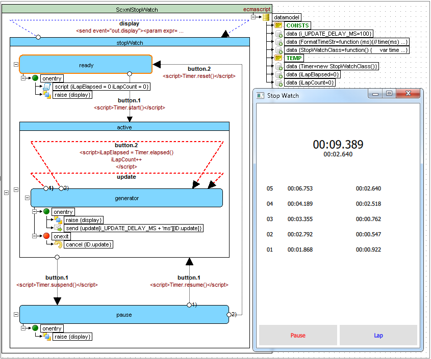

# SCXML Tutorial

This project is an attempt to illustrate the current [SCXML standard](https://www.w3.org/TR/scxml)

**New!** [Video version of the tutorial](https://youtu.be/5ebxa-nIpiE?list=PLUbY_L_9E-b_YuK-IWjUWYxcpcKccSX1N)

## Hello world


```
<scxml name="Scxml" version="1.0" xmlns="http://www.w3.org/2005/07/scxml">
	<final id="Final">
		<onentry>
			<log expr="Hello, world!" label="INFO"/>
		</onentry>
	</final>
</scxml>
```

### Table of contents
[1. \<scxml\>](Doc/scxml.md)

[2. \<state\>](Doc/state.md)

[3. \<parallel\>](Doc/parallel.md)

[4. \<transition\>](Doc/transition.md)

[5. \<initial\>](Doc/Introduction.md#initial-state)

[6. \<final\>](Doc/final.md)

[7. \<onentry\>](Doc/onentry.md)

[8. \<onexit\>](Doc/onexit.md)

[9. \<history\>](Doc/history.md)

[10. \<raise\>](Doc/raise.md)

[11. \<if\>](Doc/if_else_elseif.md#if)

[12. \<else\>](Doc/if_else_elseif.md#else)

[13. \<elseif\>](Doc/if_else_elseif.md#elseif)

[14. \<foreach\>](Doc/foreach.md)

[15. \<log\>](Doc/log.md)

[16. \<datamodel\>](Doc/datamodel.md)

[17. \<data\>](Doc/datamodel.md#data)

[18. \<assign\>](Doc/assign.md)

[19. \<donedata\>](Doc/donedata.md)

[20. \<content\>](Doc/content.md)

[21. \<param\>](Doc/param.md)

[22. \<script\>](Doc/script.md)

[23. \<send\>](Doc/send.md)

[24. \<cancel\>](Doc/cancel.md)

[25. \<invoke\>](Doc/invoke.md)

[26. \<finalize\>](Doc/finalize.md)

[27. Basic HTTP Event I/O Processor](Doc/BasicHTTPEventIO.md)

#### Examples
[1. Microwave owen](Doc/microwave_example.md)

[2. Microwave owen (using parallel)](Doc/microwave_parallel.md)

[3. Calculator](Doc/calculator.md)

[4. Salus RT500 (Digital Room Thermostat) Simulator](https://github.com/alexzhornyak/Salus-RT500-Simulator)

[5. Morse Code Trainer](https://github.com/alexzhornyak/SCXML-tutorial/tree/master/Examples/Qt/Morse)

[6. Infotainment Radio Bolero Simulator](https://github.com/alexzhornyak/SCXML-tutorial/tree/master/Examples/Qt/SkodaBoleroInfotainment)


[7. StopWatch](https://github.com/alexzhornyak/SCXML-tutorial/tree/master/Examples/Qt/StopWatch)

### Articles
[1. Inheritance (Visual) in SCXML (State Machines)](Doc/Inheritance_SCXML.md)

## [W3C Examples](Doc/W3C.md#w3c-examples)
## [W3C IRP tests](Doc/W3C.md#w3c-irp-tests)

# SCXML Overview

## Basic State Machine Notation

The most basic state machine concepts are [**\<state\>**](Doc/state.md), [**\<transition\>**](Doc/transition.md) and **event**. Each state contains a set of transitions that define how it reacts to events. Events can be generated by the state machine itself or by external entities. In a traditional state machine, the machine is always in a single state. This state is called the active state. When an event occurs, the state machine checks the transitions that are defined in the active state. If it finds one that matches the event, it moves from the active state to the state specified by the transition (called the "target" of the transition.) Thus the target state becomes the new active state.


```
<scxml initial="Start" name="Scxml" version="1.0" xmlns="http://www.w3.org/2005/07/scxml">
	<final id="Final">
		<onentry>
			<log expr="Finished!" label="INFO"/>
		</onentry>
	</final>
	<state id="Start">
		<transition event="Event" target="Final"/>
	</state>
</scxml>
```


## [Atomic state](Doc/state.md#atomic-state)

Does not contain any child states


```
<scxml name="Scxml" version="1.0" xmlns="http://www.w3.org/2005/07/scxml">
	<state id="Level 1"/>
</scxml>
```


## [Compound states](Doc/state.md#compound-state)

May contain nested <state> elements and the nesting may proceed to any depth
	

```
<scxml name="Scxml" version="1.0" xmlns="http://www.w3.org/2005/07/scxml">
	<state id="Level 1">
		<state id="Level 2">
			<state id="Level 3"/>
		</state>
	</state>
</scxml>
```


## [Parallel states](Doc/parallel.md)

The <parallel> element represents a state whose children are executed in parallel.


```
<scxml name="Scxml" version="1.0" xmlns="http://www.w3.org/2005/07/scxml">
	<parallel id="Airplane_Engines">
		<state id="Engine_1" initial="Engine_1_Off">
			<state id="Engine_1_Off">
				<transition event="Start.1" target="Engine_1_On"/>
			</state>
			<state id="Engine_1_On">
				<transition event="Shutdown.1" target="Engine_1_Off"/>
			</state>
		</state>
		<state id="Engine_2" initial="Engine_2_Off">
			<state id="Engine_2_Off">
				<transition event="Start.2" target="Engine_2_On"/>
			</state>
			<state id="Engine_2_On">
				<transition event="Shutdown.2" target="Engine_2_Off"/>
			</state>
		</state>
	</parallel>
</scxml>
```

## Initial state

Represents the default initial state for a complex [\<state\>](Doc/state.md) element


```
<scxml name="Scxml" version="1.0" xmlns="http://www.w3.org/2005/07/scxml">
	<state id="Work">
		<initial>
			<transition target="Ready"/>
		</initial>
		<state id="Ready"/>
	</state>
</scxml>
```

## [Final state](Doc/final.md)

Represents a final state of an [\<scxml\>](Doc/scxml.md) or compound [\<state\>](Doc/state.md) element.


```
<scxml name="Scxml" version="1.0" xmlns="http://www.w3.org/2005/07/scxml">
	<state id="Work">
		<transition event="done.state.Work" target="WorkFinished"/>
		<state id="CompletingTask">
			<transition target="Completed"/>
		</state>
		<final id="Completed"/>
	</state>
	<final id="WorkFinished"/>
</scxml>
```

## [History state](Doc/history.md)

The \<history\> pseudo-state allows a state machine to remember its state configuration. A [\<transition\>](Doc/transition.md) taking the <history> state as its target will return the state machine to this recorded configuration.


```
<scxml name="Scxml" version="1.0" xmlns="http://www.w3.org/2005/07/scxml">
	<state id="Work">
		<transition event="Pause" target="Expecting"/>
		<state id="Off">
			<transition event="Switch" target="On"/>
		</state>
		<state id="On">
			<transition event="Switch" target="Off"/>
		</state>
		<initial>
			<transition target="HistoryPoint"/>
		</initial>
		<history id="HistoryPoint">
			<transition target="Off"/>
		</history>
	</state>
	<state id="Expecting">
		<transition event="Resume" target="HistoryPoint"/>
	</state>
</scxml>
```

## [Transitions](Doc/transition.md)
Transitions between states are triggered by events and conditionalized via guard conditions. They may contain executable content, which is executed when the transition is taken.


```
<scxml datamodel="lua" name="Scxml" version="1.0" xmlns="http://www.w3.org/2005/07/scxml">
	<state id="Work" initial="Off">
		<transition event="Update" type="internal">
			<log expr="'Updated'" label="OnUpdate"/>
		</transition>
		<transition event="ReInit" target="Work" type="internal"/>
		<transition event="Quit" target="End"/>
		<transition event="error.*" target="Fail"/>
		<state id="Off">
			<transition cond="_event.data==1" event="Switch" target="On"/>
		</state>
		<state id="On">
			<transition cond="_event.data==0" event="Switch" target="Off"/>
		</state>
	</state>
	<final id="End"/>
	<final id="Fail"/>
</scxml>
```

## [Invoke](Doc/invoke.md)
SCXML provides an element **\<invoke\>** which can create external services. For example: it can create instances of external state machines


## [Traffic light example](https://github.com/alexzhornyak/UscxmlCLib/blob/master/Examples/StateCharts/TrafficLight.scxml)


## Time generator example

```
<scxml datamodel="lua" initial="Off" name="ScxmlTimeGenerator" version="1.0" xmlns="http://www.w3.org/2005/07/scxml">
	<datamodel>
		<data expr="0" id="tm_ELAPSED"/>
	</datamodel>
	<state id="Off">
		<transition event="Start" target="Generator"/>
	</state>
	<state id="Generator">
		<onentry>
			<assign expr="os.clock()" location="tm_ELAPSED"/>
		</onentry>
		<onexit>
			<cancel sendid="ID_TIMER"/>
		</onexit>
		<transition event="Stop" target="Off"/>
		<state id="StateShape1">
			<onentry>
				<log expr="string.format(&quot;Elapsed:%.2fs&quot;, os.clock() - tm_ELAPSED)" label="INFO"/>
				<send delay="1000ms" event="Do.Timer" id="ID_TIMER"/>
			</onentry>
			<transition event="Do.Timer" target="StateShape1"/>
		</state>
	</state>
</scxml>
```

## [Microwave owen example](Doc/microwave_example.md)


## [StopWatch example](https://github.com/alexzhornyak/SCXML-tutorial/tree/master/Examples/Qt/StopWatch)

