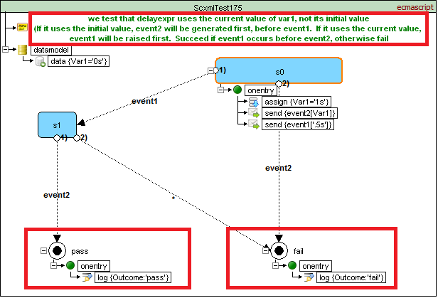

# SCXML Frameworks [W3C Standard Specification Compliance](https://www.w3.org/TR/scxml/)
It is an attempt to collect test passing results per every SCXML framework in one place.

| Framework | Datamodel | W3C Mandatory | W3C Optional |
|---|---|---|---|
| uSCXML | | | |
| Qt SCXML | ecmascript | [141 of 159](ecma/W3C/Mandatory/Auto/report__QtScxml_5_15_0___msvc2015_64bit__Win7_1.md) | [17 of 33](ecma/W3C/Optional/Auto/report__QtScxml_5_15_0___msvc2015_64bit__Win7_1.md) |

## Objective
There are variety of SCXML frameworks and validation tests passing results may vary. It means that if you write your scxml code in one platform it may not work in other.
So it would be great to see the comparison between platforms and to know from the very beginning about that platform issues.
Also there is a wish to be independent from framework owners in the meaning that we will execute tests in our conditions.

## Rules for SCXML tests
We will collect tests in the [SCXML-Tutorial/Tests](https://github.com/alexzhornyak/SCXML-tutorial/tree/master/Tests) folder. Then we will separate them by [\<datamodel\>](../Doc/datamodel.md) folders

```
SCXML-tutorial/Tests
	ecma 
		Custom 
		W3C 
			Mandatory 
				Auto 
				Manual 
			Optional 
				Auto 
				Manual
	lua
	...
```
W3C folder will collect tests based on [W3C SCXML 1.0 Implementation Report](https://www.w3.org/Voice/2013/scxml-irp/)

### Test preview



### 1. Test description
Test **MUST have commented description** as the first comment in XML document or the first comment of XML root [\<scxml\>](../Doc/scxml.md) element
> WARNING! Text in comment must be a **valid Markdown text**!

### 2. Top-level [\<final\>](../Doc/final.md) state with id `pass`
Look at the picture above

### 3. Top-level [\<final\>](../Doc/final.md) state with id `fail`
Look at the picture above

### 4. Restriction for stable configuration
We use 5 seconds timeout per stable configuration of the state machine. It means that if your state machine does nothing per 5 seconds it will be marked as failed by timeout.

### 5. Syntax errors and critical SCXML bugs
We validate only tests without XML syntax errors and critical SCXML bugs such as transition deadlock (when two states are connected with empty transitions) etc.
